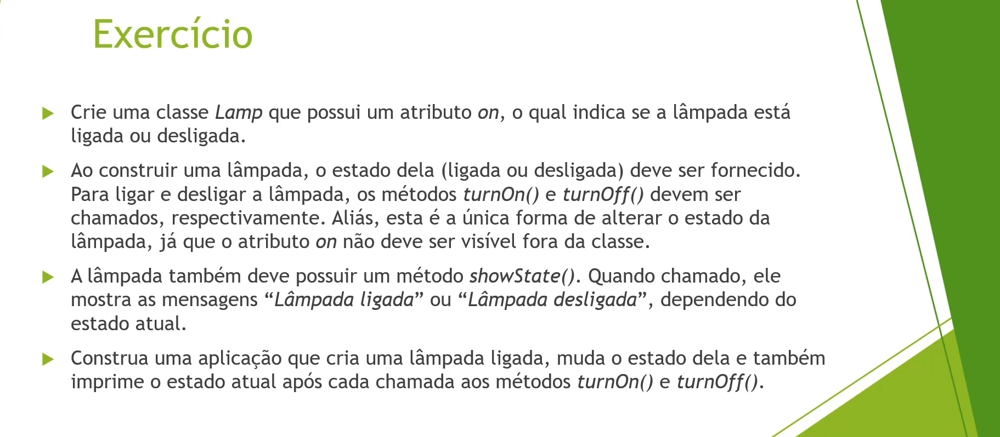
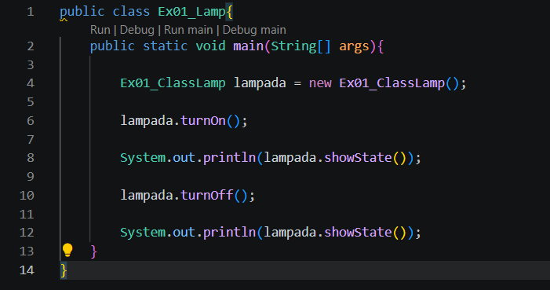
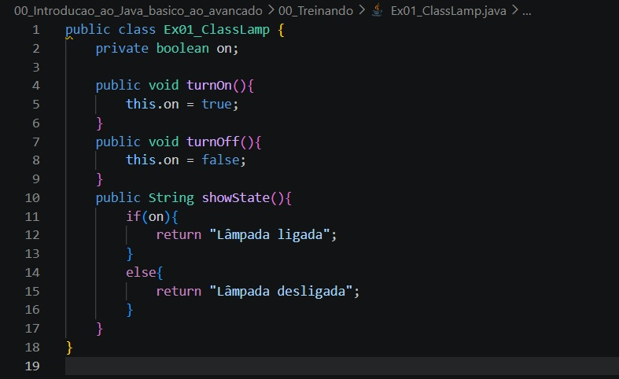
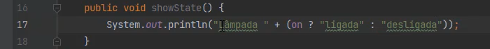
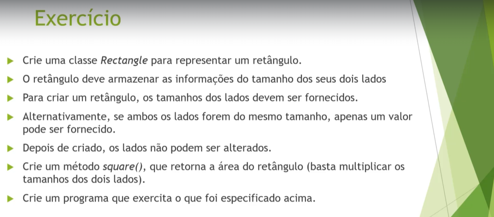
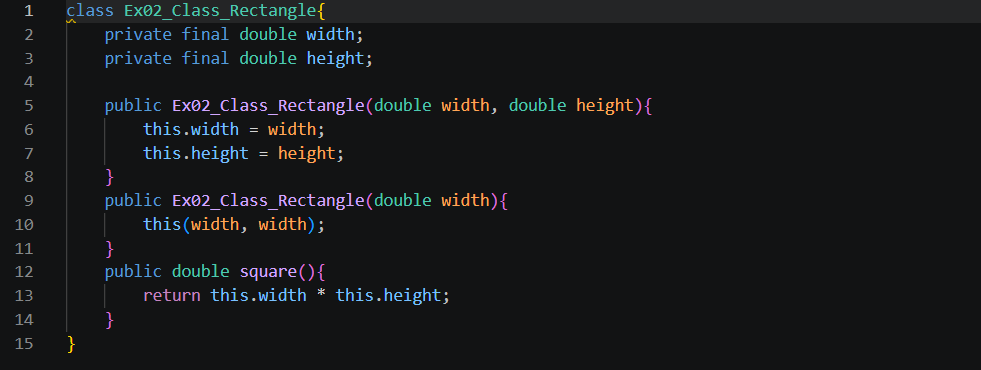
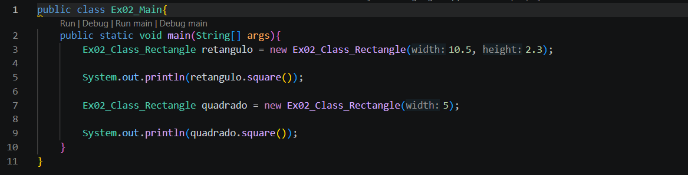

# Exercicios

## 01 Status da lâmpada

### Resolução

Podemos utilizar o if TERNÁRIO o que deixa o código menos no método showState().
Exemplo:

Assim eliminaria da linha 11 a 16 do exercicio resolvido por mim.

## 02 Retângulo

### Resolução

