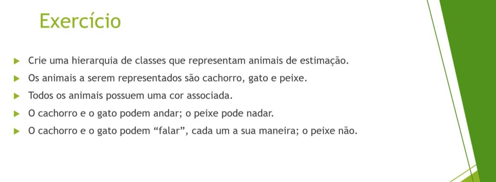
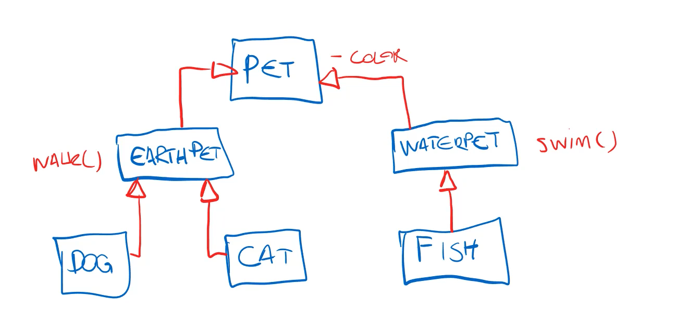
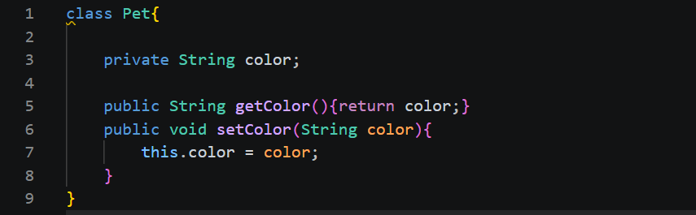
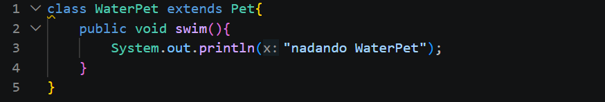
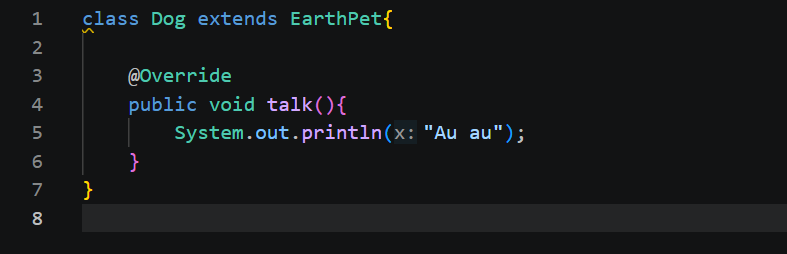
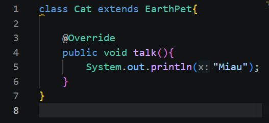
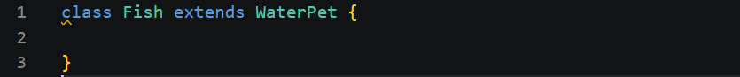
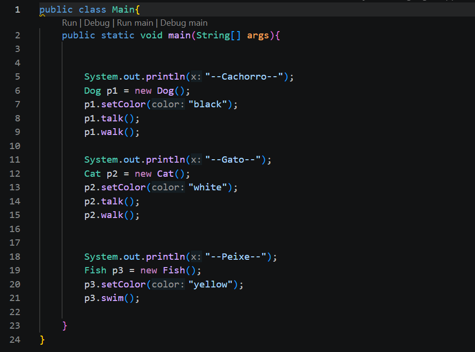

# Exercícios

## 01 Animais de Extimação

Primeiramente vamos analisar o nosso problema com um desenho para ficar mais fácil de entender

Assim conseguimo analisar:

* A classe Pai, Pet, tem 'color' o que todas as classes filhas terão;
* Depois teremos duas subclasses entre a classe pai e os nossas classes filhas as classes 'EARTHPET' que são para animais terrestres que podem andar, e a classe 'WATERPET' que oara animais aquáticos que nadam, e é nessas subclasses que implementaramos os métodos nadar e andar.
* e por fim temos as classes dog, cat e fish que são os animais que criaremos. 

### Resolução

#### Classe Pet
Essa é a classe pai que todos animais vão herdar, porque todos os animias vão ter uma cor então colocamos nela um atributo color para definir a cor do animal assim não precisamos ficar escrevendo esse código em toda classe animal, pensou mil animaisl e escrever esse código para mil animail ai precisamos mudar alguma coisa e precisa ser mudado nos mil.

#### Classe WaterPet (Animais aquáticos)
Essa é uma classe intermediária para animais aquáticos porque os animais aquáticos são diferentes de animais terrestre, exemplo do peixe o peixe não anda então não podemos criar um método andar na classe Pai, porque nosso peixe iria herdar esse método mas peixe não anda.

Mas nelas criamos o método nadar.

#### Classe EarthPet (Animais terrestres)
Essa também é uma subclasse, intermediária para animais terrestre pelo mesmo motivo dos animais aquáticos.

Mas nela criamos o método andar e falar.

#### Classe Dog
Aqui é nosso classe Dog, podemos ver que subscrevemos o método talk, falar, pois nosso cachorro late.

#### Classe Cat
Aqui é nosso classe Cat, podemos ver que subscrevemos o método talk, falar, pois nosso gato mia.

#### Classe Fish
Essa é nossa classe Fish, usada para instanciar peixes.

#### Classe Main
A classe principal onde instanciamos nossos objetos, animais domésticos.

