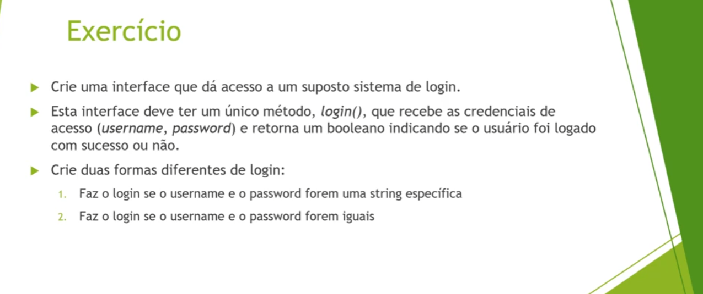
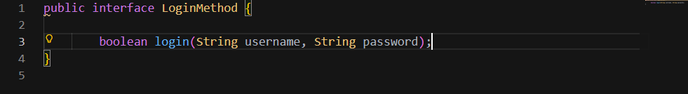
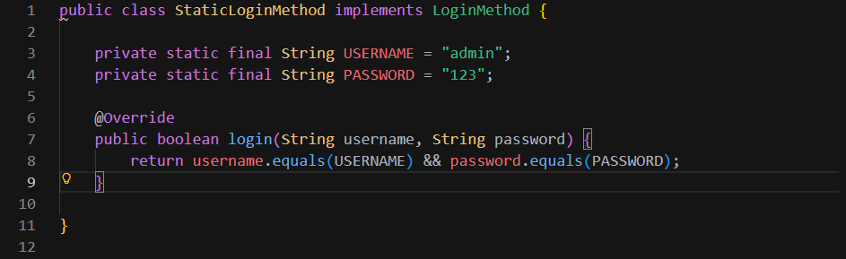
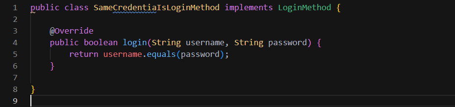
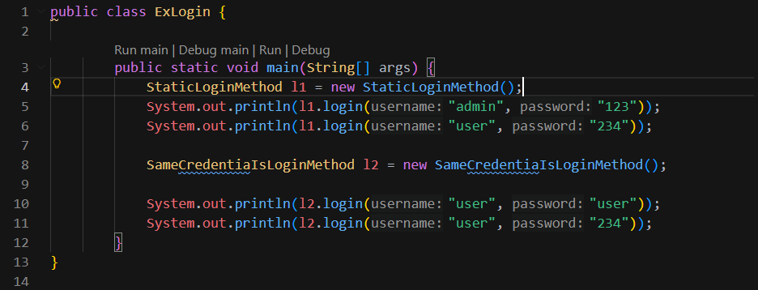

# Exercícios

## Resolução
### Interface LoginMethod
](image-1.png)

### Classe StaticLoginMethod que implemente a Interface LoginMethod

### Classe SameCredentiaIsLoginMethod que implemente a Interface LoginMethod

### Classe principal ExLogin

