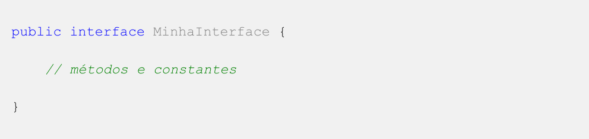
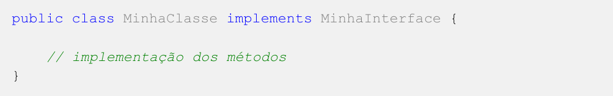
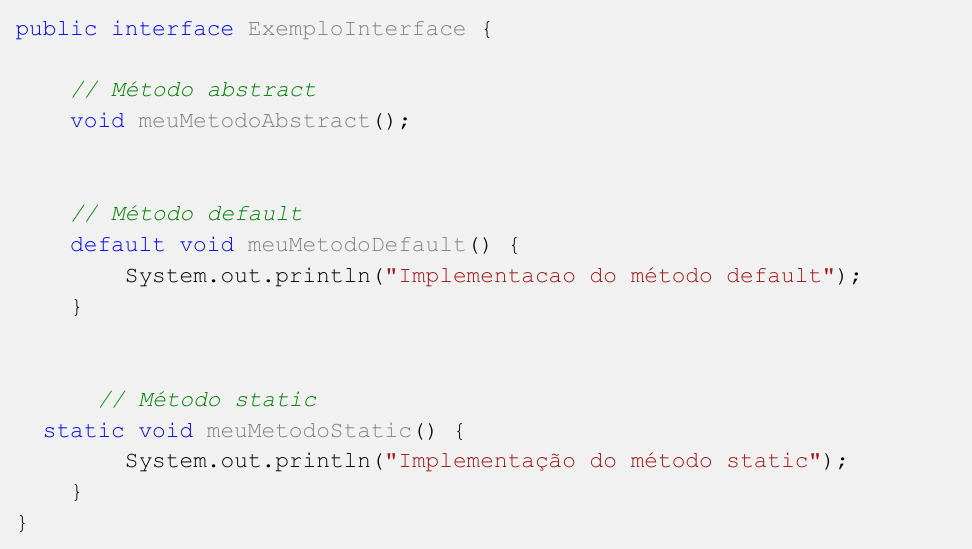

# Interfaces

Para definir (criar) uma interface usamos a palavra-chave `interface`

## Implementando uma Interface
Uma classe implementa uma interface usando a palavra-chave implements. Por exemplo: 

## REGRAS DE INTERFACE
* Não podem ser instanciadas.

* Todos os atributos dentro de uma interface são obrigatoriamente public, final e static.

* Todos os métodos devem ser o mais acessível possível, ou seja, devem ser public.

* A palavra ´abstract´ no método é opcional.
Uma interface pode estender outras interfaces.

## Casos especiais de Interfaces
* Métodos ``default`` e ``static``.
* Métodos ``default`` e ``static`` não precisam ser sobrescritos

### Interface em Java com métodos abstract, default e static:

