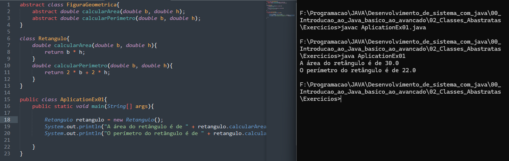
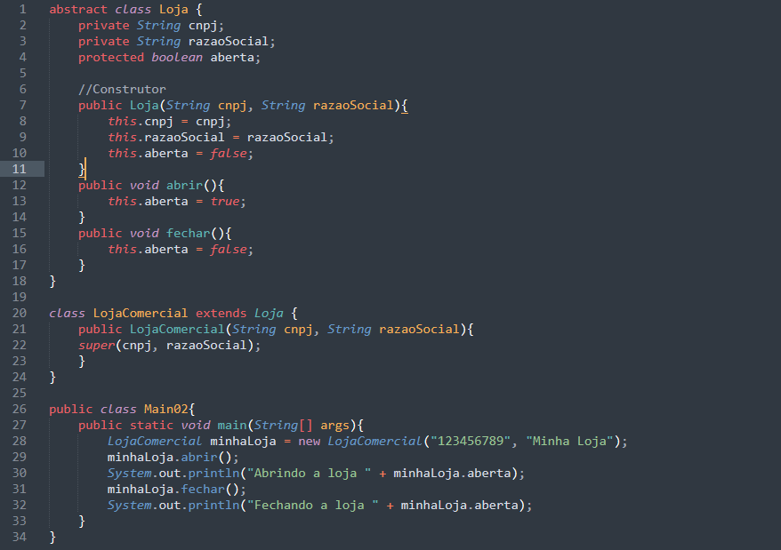

# Exercício 1 : Criando uma Classe Abstrata para Figuras Geométrica

### Objetivo
O objetivo deste exercício é praticar a criação e utilização de classes abstratas e a implementação de métodos abstratos em Java.

### Instruções
1. Crie uma classe abstrata chamada ``FiguraGeometrica`` com dois métodos abstratos: ``calcularArea`` e ``calcularPerimetro``.

2. Implemente a classe ``FiguraGeometrica`` em uma classe concreta chamada ``Retangulo``.

3. Crie uma classe chamada ``Main`` com o método ``main`` para testar a implementação da classe ``Retangulo``.

4. Compile e execute o programa para verificar os resultados.

### Passos para Fazer o Exercício
1. Criação da Classe Abstrata ``FiguraGeometrica``:

     *  Defina a classe abstrata ``FiguraGeometrica`` com os métodos abstratos calcularArea e calcularPerimetro.

2. Implementação da Classe ``Retangulo``:

    * Crie a classe ``Retangulo`` que estende ``FiguraGeometrica``.

    * Adicione os atributos ``base`` e ``altura`` à classe ``Retangulo``.

    * Implemente os métodos ``calcularArea`` e ``calcularPerimetro`` na classe ``Retangulo``.

3. Criação da Classe ``Main``:

    * Defina a classe ``Main``.

    * No método ``main``, crie uma instância de ``Retangulo``.

    * Chame os métodos ``calcularArea`` e ``calcularPerimetro`` para a instância criada.

    * Imprima os resultados no console.

4. Compilação e Execução:

    * Compile o código utilizando um compilador Java.

    * Execute o programa e verifique os resultados impressos no console.

Solução do Exercício

# Exercício 2 : Loja Abstrata

### Objetivo
O objetivo deste exercício é praticar a criação e utilização de classes abstratas e a implementação de métodos concretos em Java.

### Instruções
1. Crie uma classe abstrata chamada ``Loja`` com atributos e métodos para abrir e fechar a loja.

2. Implemente a classe ``Loja`` em uma classe concreta chamada ``LojaComercial``.

3. Crie uma classe chamada ``Main`` com o método ``main`` para testar a implementação da classe ``LojaComercial``.

4. Compile e execute o programa para verificar os resultados.

### Passos para Fazer o Exercício
1. Criação da Classe Abstrata ``Loja``:

    * Defina a classe abstrata ``Loja`` com os atributos ``cnpj``, ``razaoSocial`` e ``aberta``.

    * Adicione os métodos ``abrir`` e ``fechar`` para controlar o estado da loja.

2. Implementação da Classe ``LojaComercial``:

    * Crie a classe ``LojaComercial`` que estende ``Loja``.

    * Implemente o construtor da classe ``LojaComercial``.

3. Criação da Classe ``Main``:

    * Defina a classe ``Main``.

    * No método ``main``, crie uma instância de ``LojaComercial``.

    * Chame os métodos ``abrir`` e ``fechar`` para a instância criada.

    * Imprima os resultados no console.

4. Compilação e Execução:

    * Compile o código utilizando um compilador Java.

    * Execute o programa e verifique os resultados impressos no console.

### Solução do Exercício

