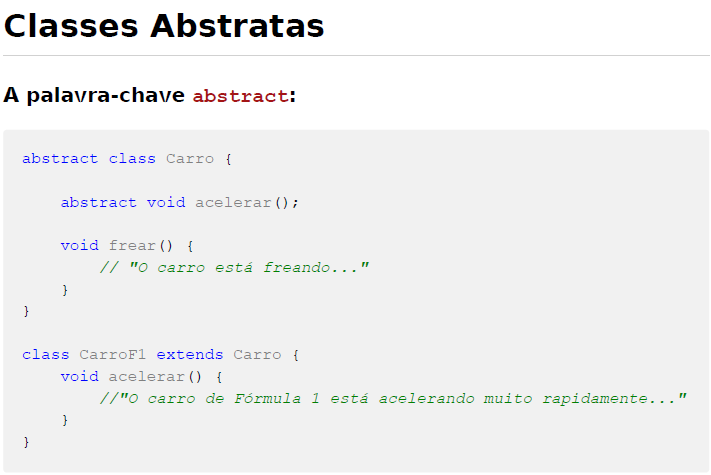
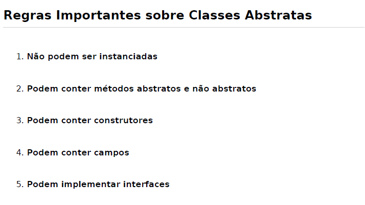
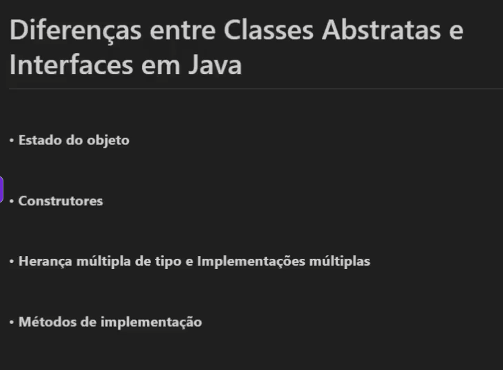
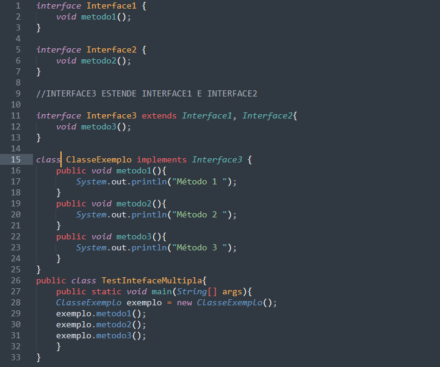
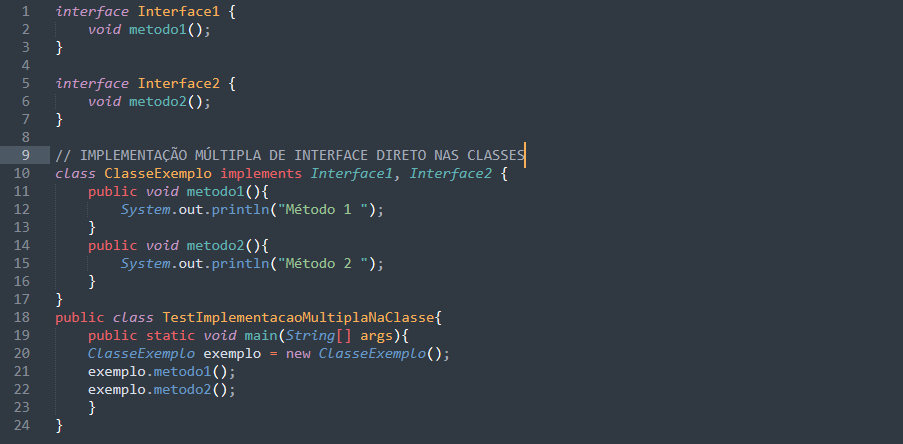
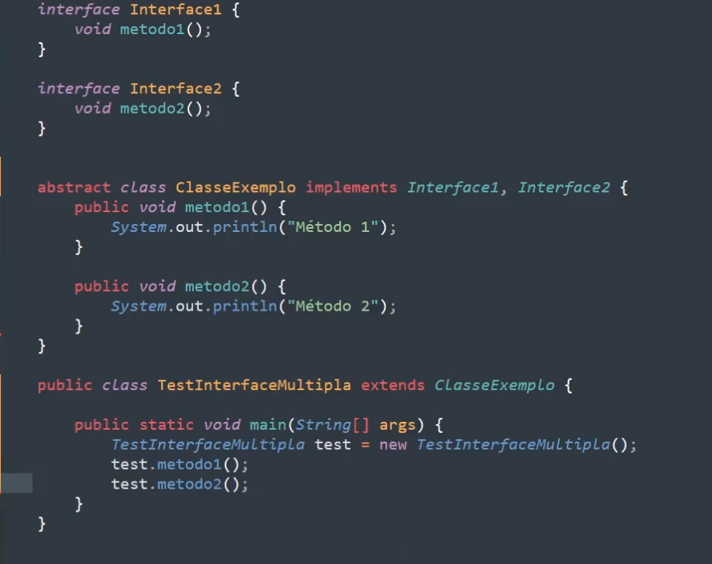

# Classes Abstratas

* Em Java não é permitido extender várias classes de heranças somente uma, mas é permitido herança mútipla de tipo e Implementações múltiplas. EXEMPLO: 

* IMPLEMENTAÇÃO MÚLTIPLA DE INTERFACE DIRETO NA CLASSE:
 

* MÉTODOS DE IMPLEMENTAÇÃO EM CLASSES ABSTRATAS:
