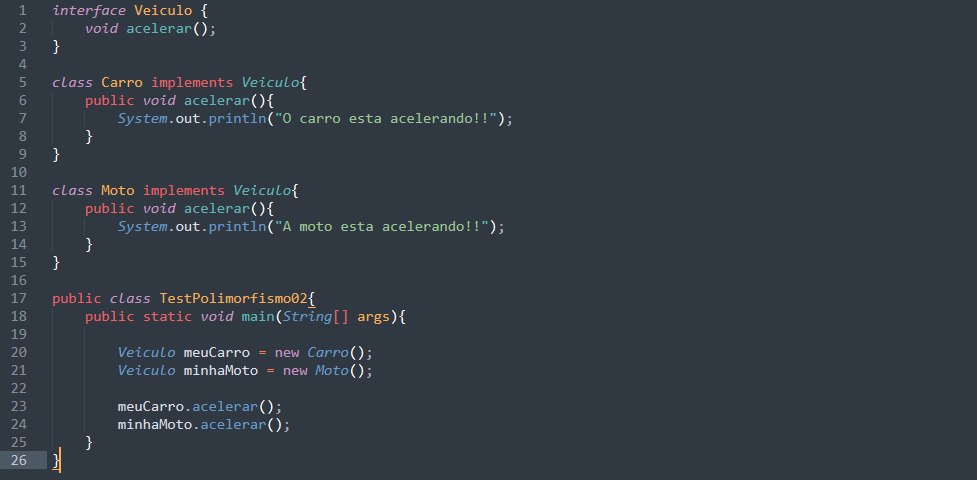

# POLIMORFISMO

* O polimorfismo é como um camaleão
* O polimorfismo é avaliado durante o runtime
* O polimorfismo permite a reutilização de código

## Sintaxe de Polimorfismo

### Exemplo de Polimorfismo em classes

### Exemplo de Polimorfismo em interface

