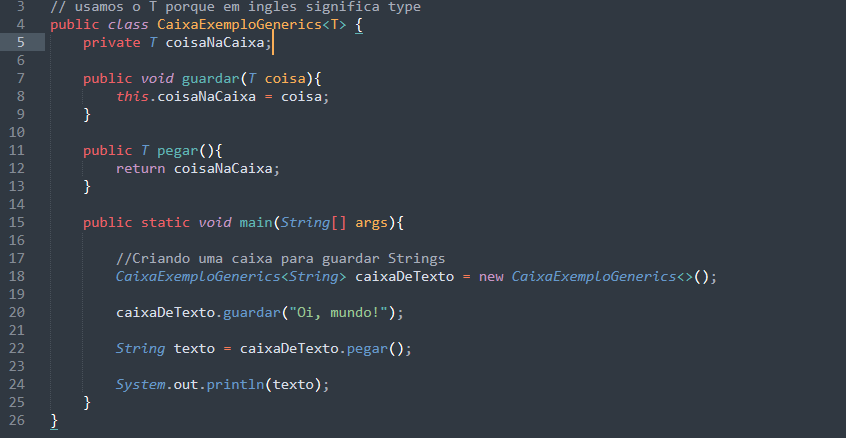
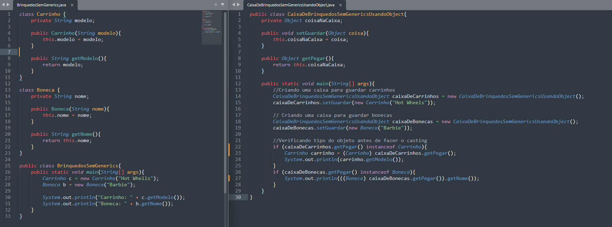
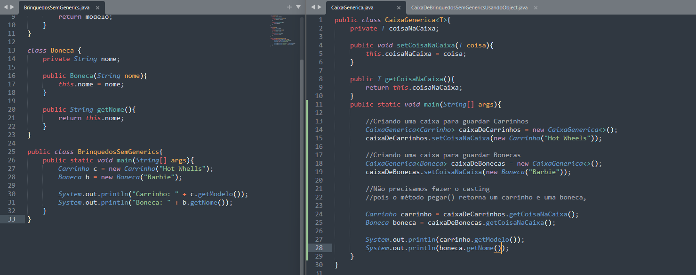

# Generics

## Exemplo

## Exemplo de usar o Object e não o Generics
Antes de surgi o generics muitos projetos usavam o object para criar classes genericas e possivelmente poderemos encontrar muitos projetos assim 

Classes padrões para o exemplo tudo se encontra no mesmo pacote:

## Exemplo utilizando o Generics
