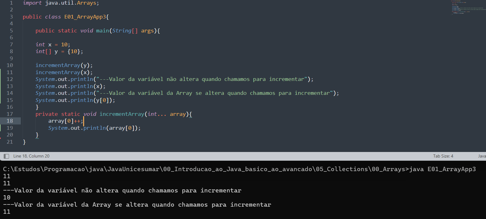
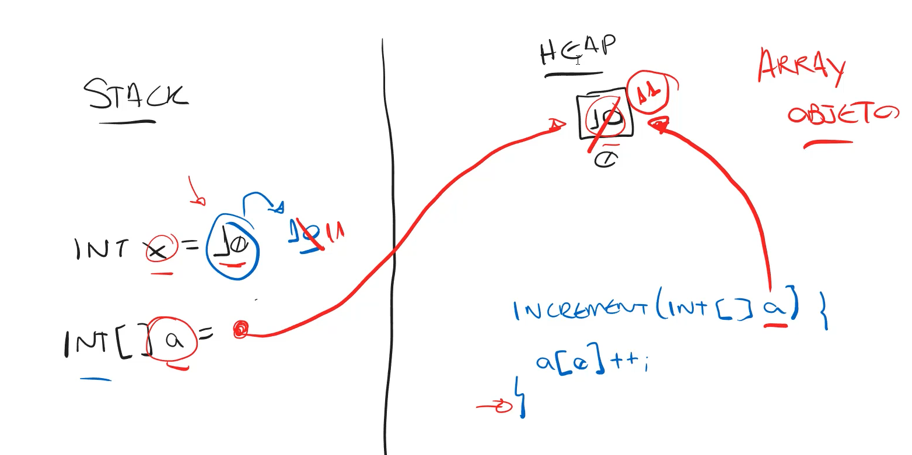
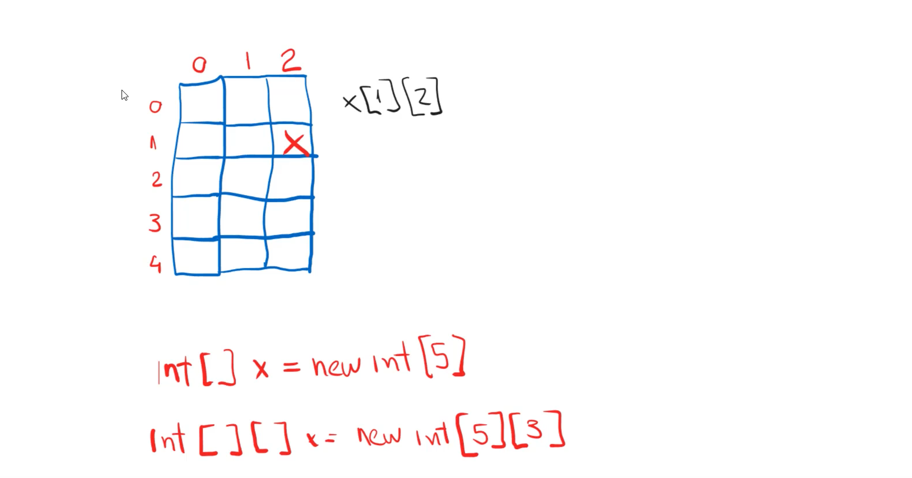
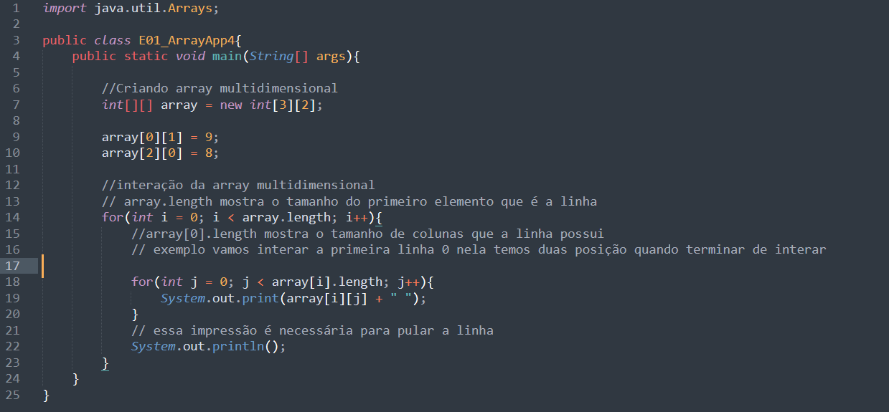
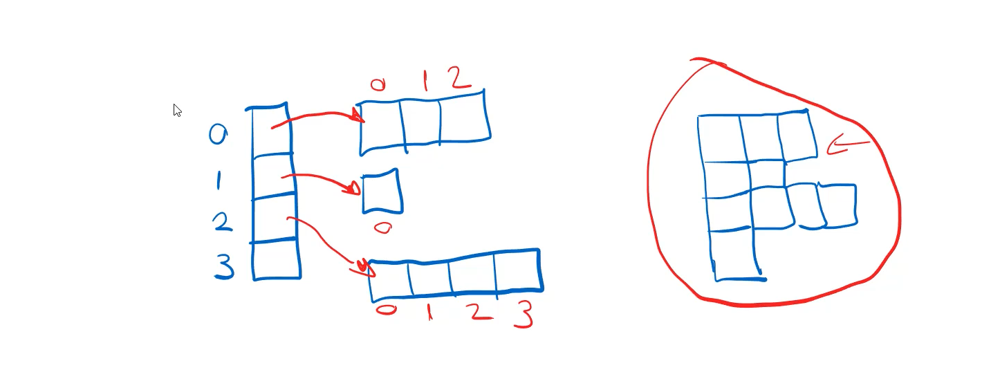
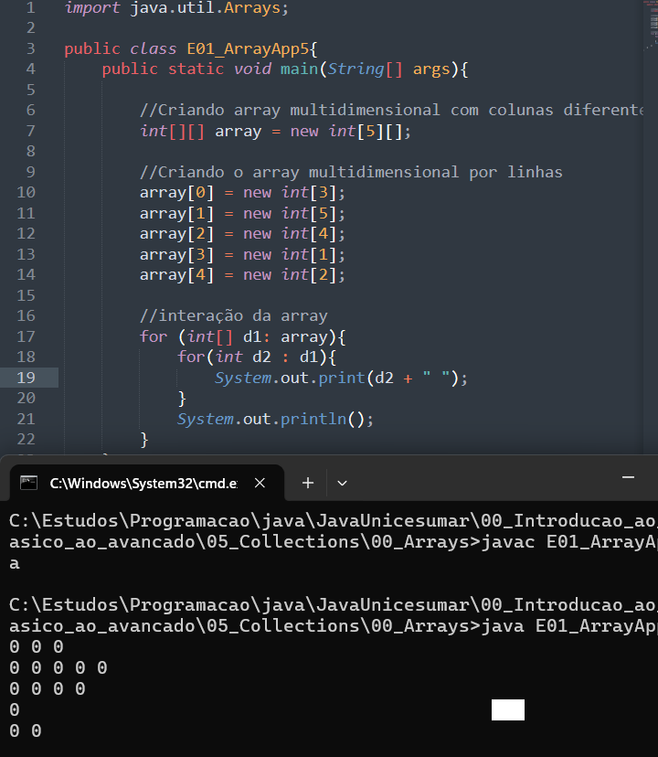

# Inicialiazação de array

Para inicializar uma arrays primeiramente precisamos importa ele do pacote ``java.util``, como o exemplo abaixo:

Agora para inicializar o Array precisamos "instanciar" é como se fosse instanciar um objeto passando o tipo que vai ser a nossa array, o nome da array, e por final o comprimento que ela vai ter, em java uma array tem tamanho fixo esse tamanho não pode ser modificado depois, então o tamanho de uma array é imutável.

Podemos observar na linha 8 que declaramos uma array do tipo int, ``int[]``, atribuímos o nome de ``n`` e colocamos o tamanho da nossa array de 5, ``new int[5]``.

Também podemos instanciar a nossa array atribuindo valores já dentro da array, nesse caso não dissemos o tamanho da array, pois o java já vai ter os dados que vão ocupar a array então não tem necessidade de informar o tamanho da array

Podemos observar também um jeito mais simplificado, na linha 28, quando já atribuímos valores a array para a sua inicialização.

# Stack e Heap
Os ARRAYS SÃO OBJETOS, eles são armazenados no Heap, então seus valores não são copiados e sim a localização do objeto e quando modificamos os dados dentro desse objeto eles são alterados, já os valores primitivos quando incrementamos esses valores são copiados e quando terminado um laço for esses valores voltam ao normal. Exemplo:

E isso acontece pois é onde os dados estão armazenados, então devemos ter cuidado.

# Array multidimensionais

## Interação de array multidimensionais 

## linhas com valores diferentes de colunas 

