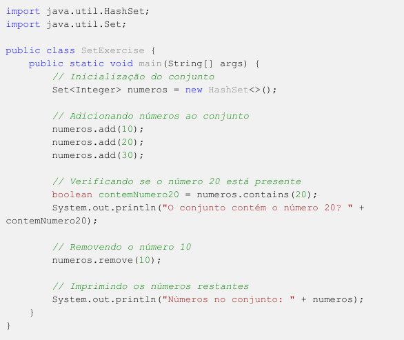

# Exercício: Manipulando Conjuntos (Set) em Java

## Objetivo
O objetivo deste exercício é praticar o uso da interface Set para armazenar elementos únicos em Java.

## Instruções
1. Crie uma classe chamada ``SetExercise``.

2. No método ``main``, declare e inicialize um conjunto (set) de números inteiros.

3. Adicione alguns números inteiros ao conjunto.

4. Verifique se um número específico está presente no conjunto.

5. Remova um número do conjunto.

6. Imprima todos os números restantes no conjunto.

## Passos para fazê-lo
Crie a classe ``SetExercise``.

Declare uma variável do tipo ``Set<Integer>`` e inicialize-a com um conjunto vazio.

Adicione alguns números inteiros usando o método ``add``.

Use o método ``contains`` para verificar se um número específico está presente no conjunto.

Remova um número usando o método ``remove``.

Utilize a representação padrão do conjunto na impressão.

## Solução do Exercício
