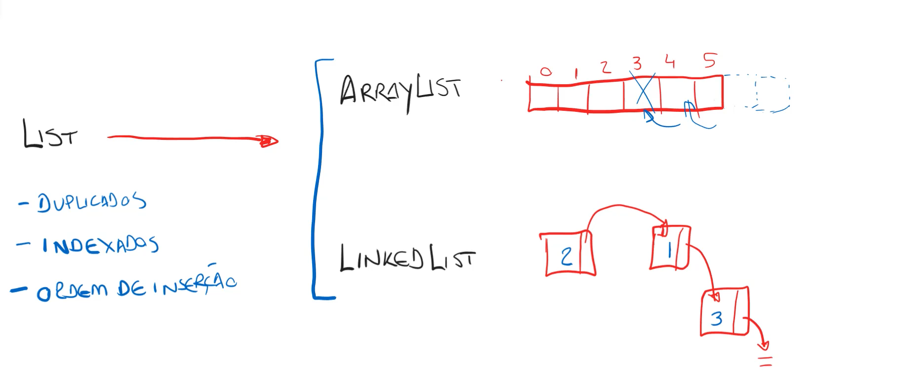
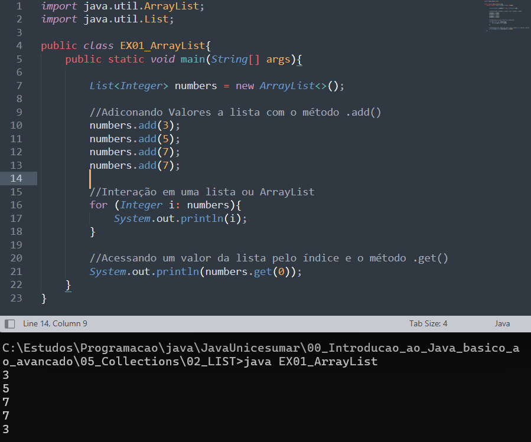
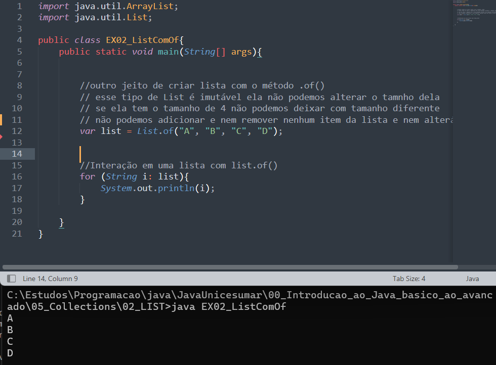
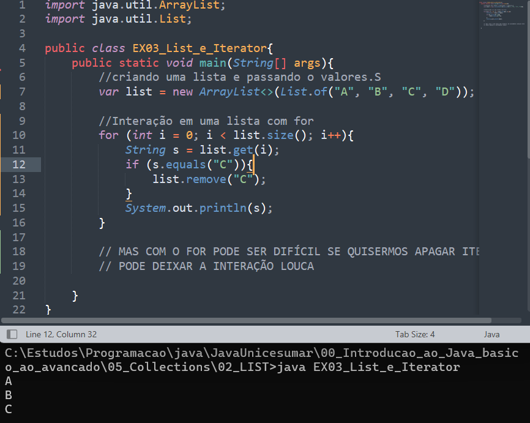
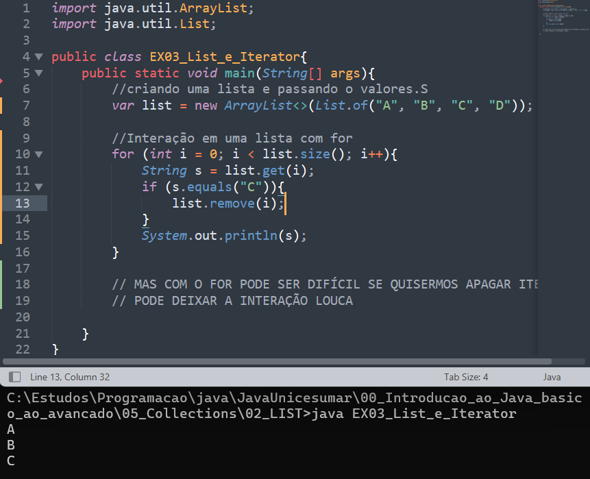
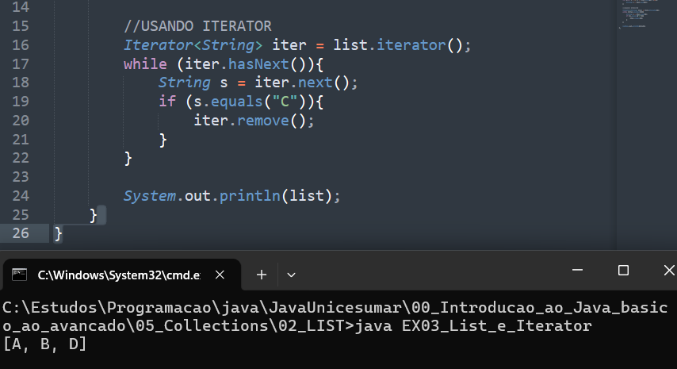
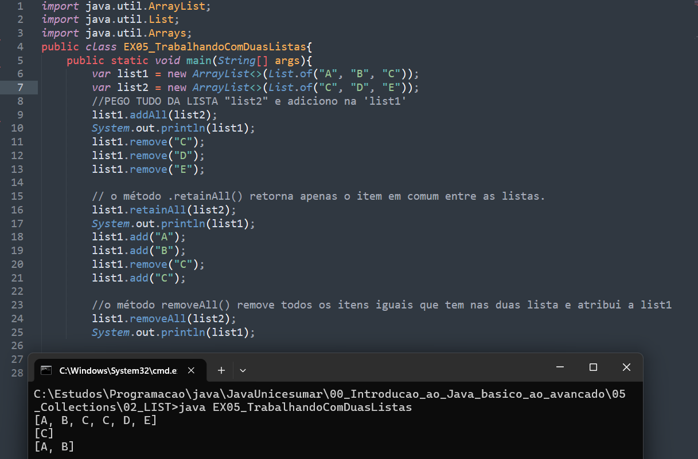

# List Interface

## Introdução ArrayList e LinkedList 

Podemos observar na imagem abaixo:
* como podemos instanciar uma lista, 
* como podemos adicionar um valor dentro da lista, 
* como interar uma lista
* Usar o método ``.get(0)`` com um índice dentro, para pegar o valor de um determinado índice da lista

### Lista criado com o List.of são listas IMUTÁVEIS

## Iterator
Quando usamo o for para tentar excluir um item da lista na sua interação ocorre erro, pois definimos o tamanho da lista e der repente o tamanho da lista se altera dentro do for isso não pode ocorrer e devemos corrigir isso para o for continuar funcionando, para não nos preocuparmos e quisermos excluir um item da lista na sua interação podemos utilizar o iterator. A figura abaixa mostra o erro quando tentamos compilar o código com uma remoção no for. 

Já com o iterator podemos realizar essa remoção com tranquilidade

## Trabalhando com duas listas

## 