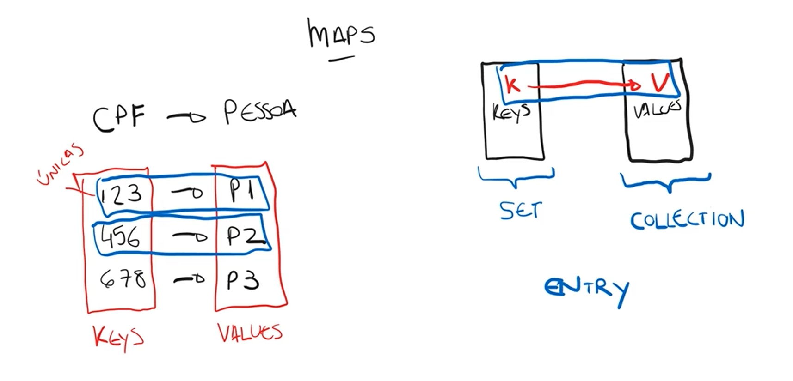
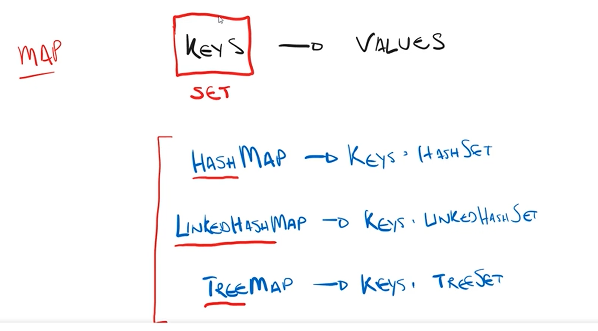
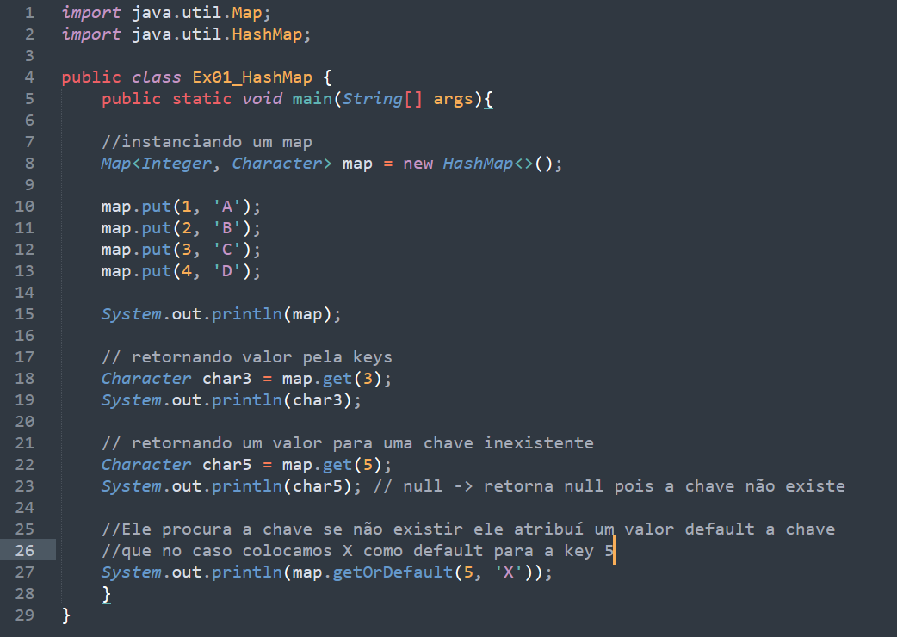
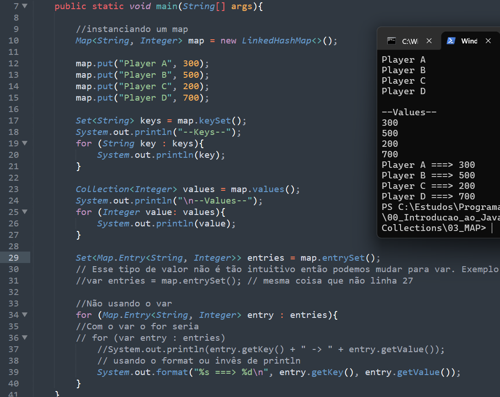

# MAP

## Introdução

* Características principais
    - Cada chave é única.
    - Valores podem se repetir.
    - Permite buscar dados rapidamente usando a chave.
    - Faz parte do Java Collections Framework.
    - Não implementa diretamente a interface Collection.

## Principais implementações

###  HashMap
- Mais utilizado
- Alta performance
- Não mantém ordem dos elementos
### LinkedHashMap
- Mantém a ordem de inserção
### TreeMap
- Mantém os elementos ordenados automaticamente

## Operações com usando o Map

## Interando sobre um Map sem e com Entry
