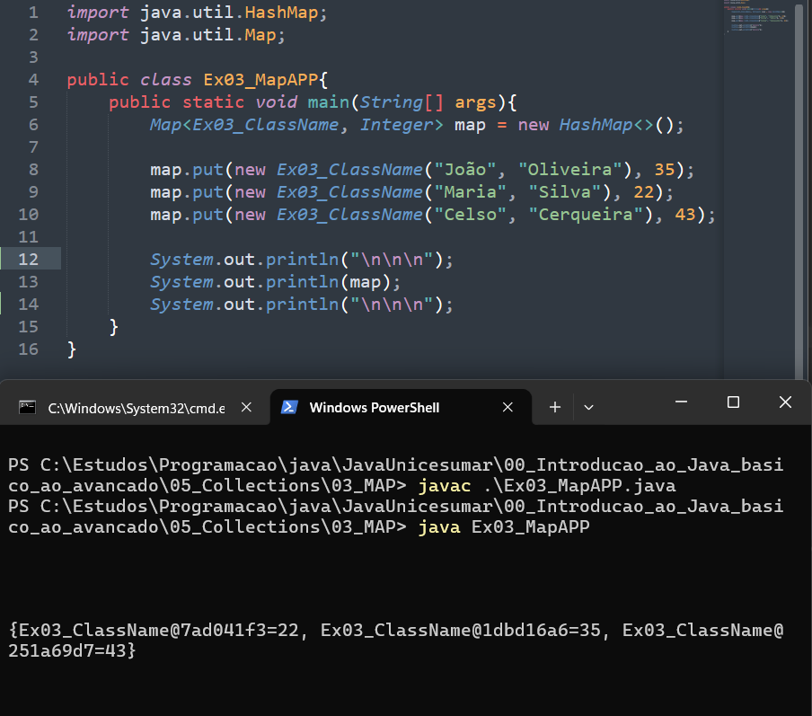
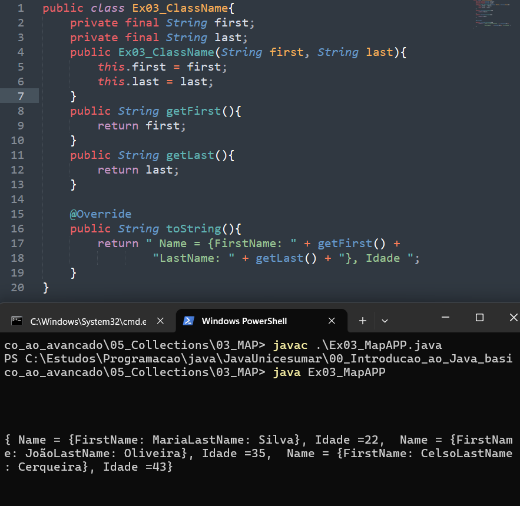
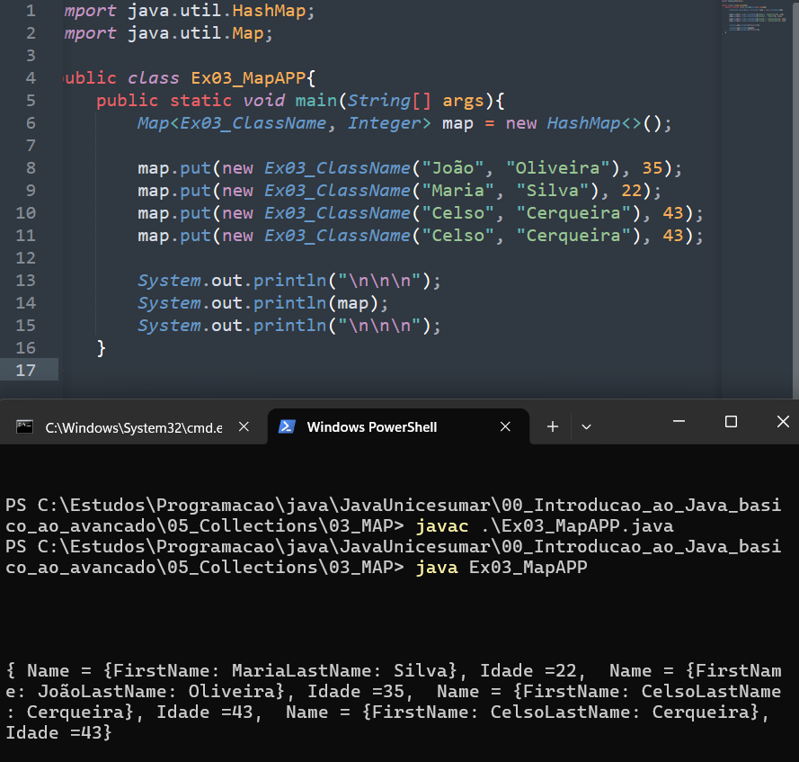
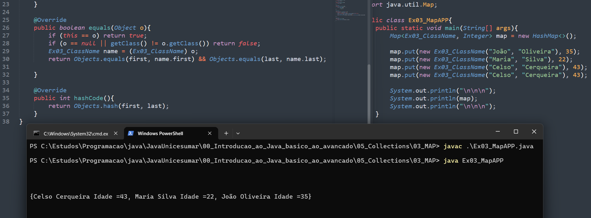

# MAP

## Introdução

* Características principais
    - Cada chave é única.
    - Valores podem se repetir.
    - Permite buscar dados rapidamente usando a chave.
    - Faz parte do Java Collections Framework.
    - Não implementa diretamente a interface Collection.

## Principais implementações

###  HashMap
- Mais utilizado
- Alta performance
- Não mantém ordem dos elementos
### LinkedHashMap
- Mantém a ordem de inserção
### TreeMap
- Mantém os elementos ordenados automaticamente

## Operações com usando o Map

## Interando sobre um Map sem e com Entry

### Map em Objetos criados os cuidados

- Visualização dos dados

Como podemos observar na imagem quando formos usar o map em objetos criados e queremos imprimi-los o que nós vamos imprimir é o endereço de onde ele foi armazenados e não os dados do objeto, para corrigirmos isso temos que escrever o método toString() no objeto para que isso não ocorra, exemplo:

- Inserção de dados duplicados
Outro coidado que temos ter que quando trabalhos com objetos o Map não vai conseguir destiguir dados diferentes, pois todos os objetos criados são criados um separados do outro então se instanciarmos outro usuário com os mesmos dados o map vai deixar inserir normalmentes, pois o que ele análisa é o endereço do objetos e não os dados que estão dentro dele, podemos observar na imagem abaixo que conseguimos inserir dois ``Celso Cerqueira`` sem problema nenhum linhas 10 e 11.

Para corrigirmos isso temos que sobrescrever os métodos ``equals()`` e ``hashCode()`` para que ele possa comparar as keys e não adicionar dados duplicados, exemplo:

Podemos Observar que apesar de termos dois Cels Cerqueira instanciados, apenas um foi adicionado em nosso map agora isso ocorreu porque sobrescrevemos os métodos ``equals()`` e ``hashCode()``
