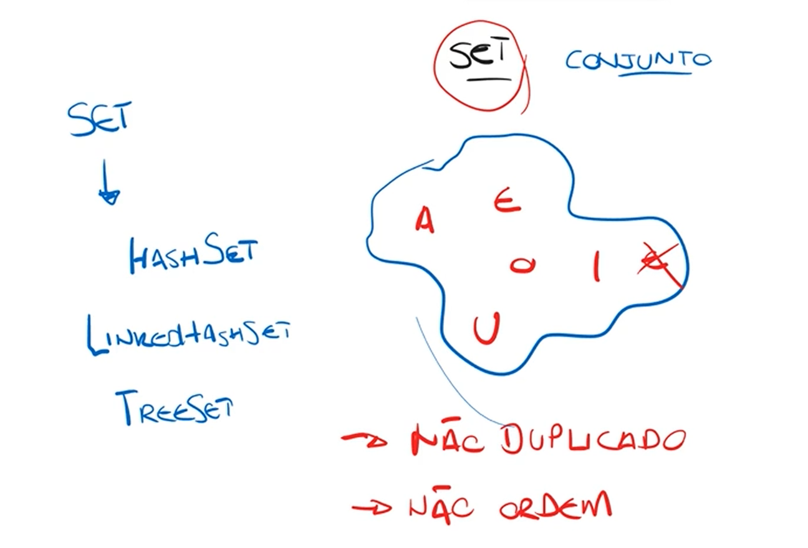
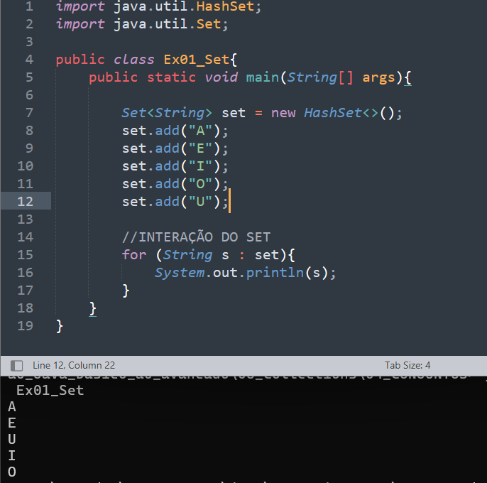
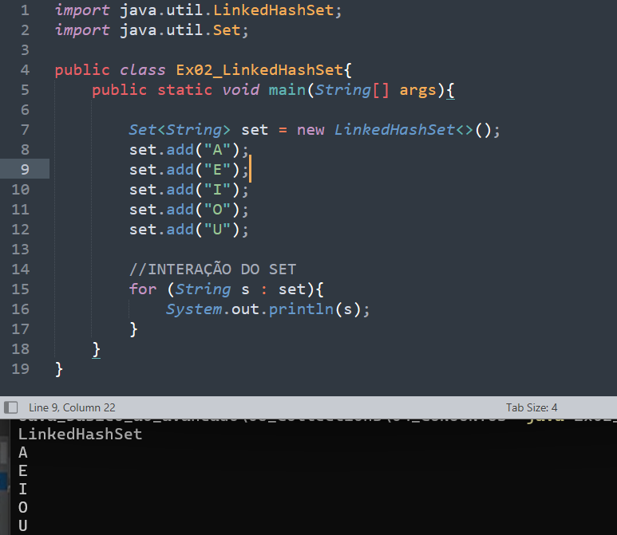

# Conjunto (SET)
* Não existe dados duplicados dentro de conjuntos;
* Os dados não são ordenados.

## HashSet (Não deixa os itens ordenados)
Quando instaciamos pelo ``HashSet`` nosso conjunto não quando informações na ordem que adicionamos item então se seu foco é ter um conjunto com informações na ordem que inserirmos o ``HashSet`` não é ele. 

## LinkedHashSet (Deixa os itens ordenados)
Já o LinkedHashSet deixa o conteúdo na ordem em que inserimos
