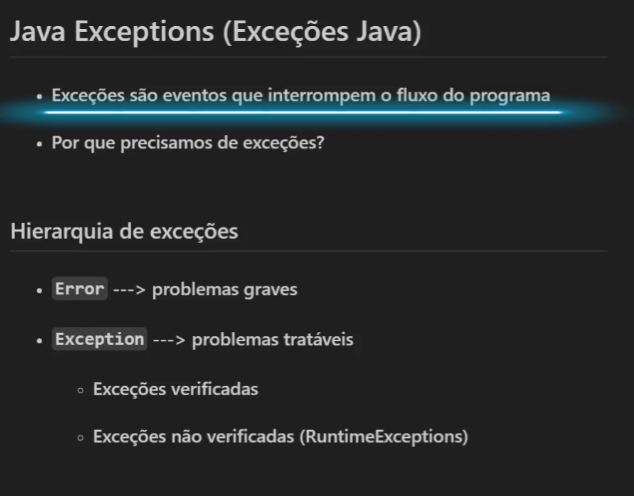
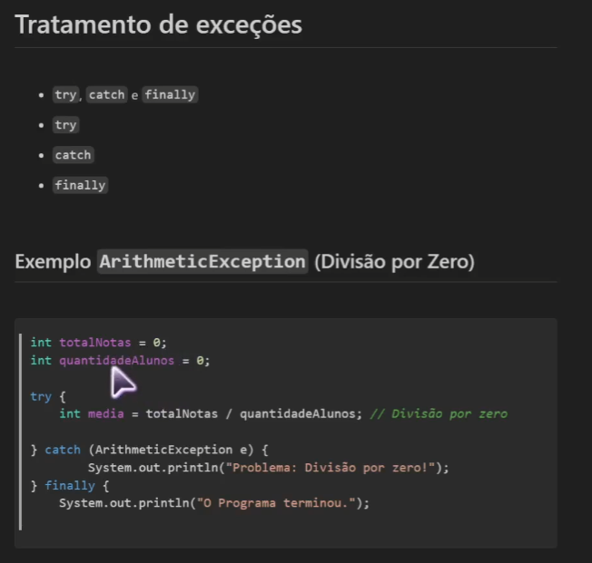
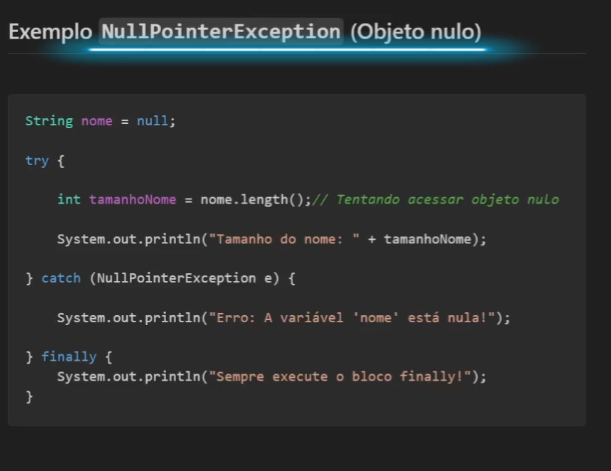
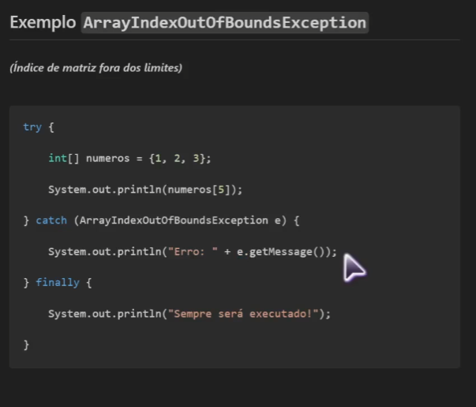
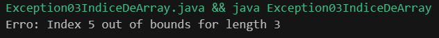
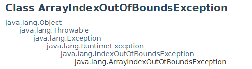
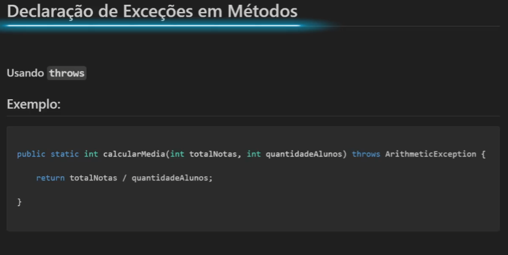

# Exceptions

## Tratamento de Exceções

## Exemplo de NullPointerException (Objeto nulo)

## Exemplo de ArrayIndexOutOfBoundsException (Erro quando tentamos acessar um índice que não existe em nossa array)

Como vemos em nossa imagem estamos tentando acessar em nossa array o índice 5 mas a nossa array vai até o índice 2 pois ela só possui 3 elementos com os índices 0, 1, 2. A mensagem de erro será

Tradução: Índice 5 fora dos limites para o tamanho 3

# Hierarquia dos Exceptions

# Declaração de Exceçoes em métodos

Usando o ``throws``

* Quando eu utilizo o ``throws`` no método eu obrigado a quem chamar esse método a usar o ``try`` e o ``catch``. Exemplo:

