# URLs, métodos HTTP e códigos de status

A URL que digitamos no navegador é muito mais do que um endereço. Ela representa o caminho até um recurso na Web e segue uma estrutura bem definida (Kuros; Ross, 2020). Compreender essa estrutura é essencial para construir aplicações Java que saibam interpretar o que o cliente está solicitando. Uma URL (Uniform Resource Locator) pode ser dividida em partes, confira a seguir:

```
https://www.exemplo.com:443/produtos?categoria=livros

```
1.  A primeira parte, https, indica o protocolo utilizado para a comunicação, que pode ser http ou https (versão segura). 

2. Em seguida, temos www.exemplo.com, que é o domínio, ou seja, o nome que identifica o servidor que hospeda o site. 

3. Logo após, :443 representa a porta utilizada pela aplicação — neste caso, a 443, que é a padrão para conexões seguras, motivo pelo qual muitas vezes ela nem aparece.

4. O trecho /produtos corresponde ao caminho, que indica qual recurso está sendo solicitado dentro do servidor.

5. Por fim, ?categoria=livros mostra os parâmetros enviados na URL, no formato chave=valor, que servem para transmitir informações adicionais à aplicação, como neste caso, a categoria desejada.

# Formulários HTML e envio de dados
Um dos recursos mais importantes do HTML para quem desenvolve aplicações web é o formulário. É por meio dele que os usuários interagem com o sistema, enviando informações que serão processadas no servidor. Em uma aplicação Java, isso significa que os dados inseridos em um formulário serão recebidos por um Servlet, tratados e, muitas vezes, armazenados em um banco de dados. A estrutura básica de um formulário HTML é simples. Veja um exemplo:
```
<form action="/cadastrar" method="post">
  <label for="nome">Nome:</label>
  <input type="text" id="nome" name="nome">

  <label for="email">Email:</label>
  <input type="email" id="email" name="email">

  <button type="submit">Enviar</button>
</form>
```
Nesse exemplo, o atributo action indica para onde os dados são enviados. Já o method define como eles serão enviados. Se for GET, os dados vão na URL. Se for POST, eles são enviados no corpo da requisição (Wolf, 2023).

Cada input representa um campo de preenchimento. O atributo name define o nome da variável que será recebida do lado do servidor. Em aplicações Java com Servlets, podemos acessar esse valor usando (Oracle, 2020):
```
String nome = request.getParameter("nome");
```

# Cabeçalhos HTTP e tipos de conteúdo
Quando um formulário é enviado ou uma requisição é feita pelo navegador, não é apenas o conteúdo da mensagem que importa. Os cabeçalhos HTTP desempenham um papel crucial na comunicação entre cliente e servidor (Kurose; Ross, 2020). Eles fornecem informações que ajudam o servidor a entender melhor o que está chegando e como deve responder.

Um dos cabeçalhos mais importantes é o Content-Type. Ele indica o formato dos dados enviados na requisição ou retornados na resposta. Por exemplo, ao enviar um formulário, o navegador geralmente utiliza:
```
Content-Type: application/x-www-form-urlencoded
```
Esse tipo de conteúdo significa que os dados foram codificados no formato padrão de formulários HTML, como nome=Maria&email=maria@example.com. Esse é o formato que o Java está acostumado a processar usando o método request.getParameter(). Existem outros tipos de conteúdo muito comuns no desenvolvimento web (Kurose; Ross, 2020):

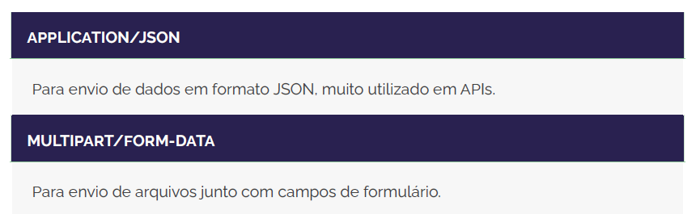
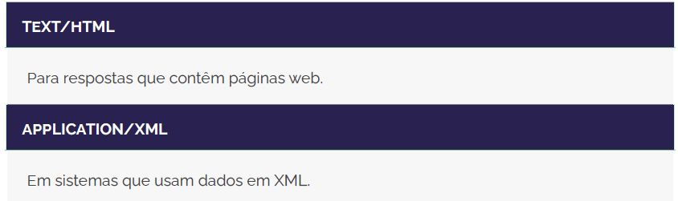

Imagine que sua aplicação Java receba uma requisição com Content-Type: application/json. Nesse caso, os dados não estarão disponíveis por getParameter() diretamente. Você precisará ler o corpo da requisição e usar uma biblioteca como o Jackson ou Gson para interpretar o JSON.

Os cabeçalhos também controlam a resposta (Kurose and Ross, 2020). O servidor pode indicar, por exemplo: Content-Type: text/html. Isso sinaliza ao navegador que a resposta deve ser interpretada como uma página HTML. Se a resposta for um arquivo para download, o servidor pode usar application/octet-stream, e o navegador oferecerá o arquivo ao usuário.

# INTRODUÇÃO AO JDBC E SEU PAPEL NO JAVA WEB

O JDBC atua como uma ponte entre a aplicação Java e o banco de dados. Ele fornece um conjunto de classes e interfaces que tornam possível abrir conexões, executar instruções e recuperar dados, independentemente do sistema de banco utilizado, como MySQL, PostgreSQL ou Oracle. O que muda, nesses casos, é apenas o driver específico (Oracle, 2020).

## Etapas de Conexão: Driver, URL, Conexão, Statement, ResultSet
Estabelecer uma conexão entre uma aplicação Java e um banco de dados usando JDBC envolve uma sequência de passos bem definida. Compreender cada etapa é essencial para garantir que a comunicação ocorra de forma eficiente, segura e sem erros (Oracle, 2020). A seguir, explicamos o papel de cada componente envolvido nesse processo.
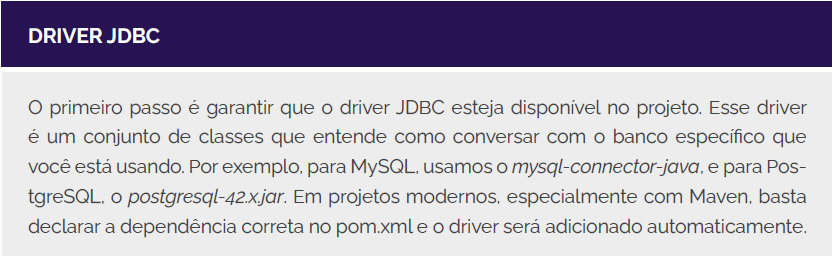
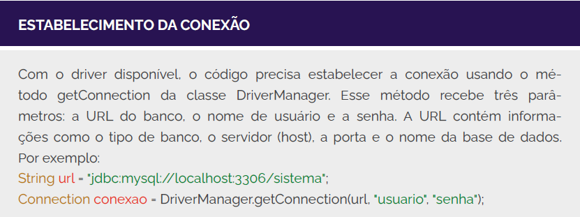
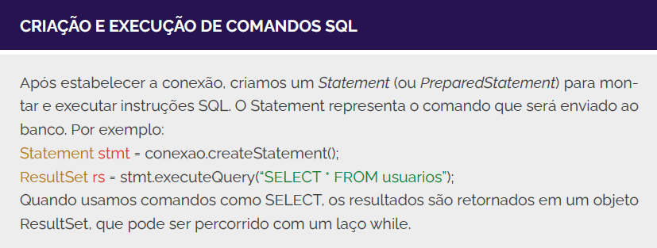
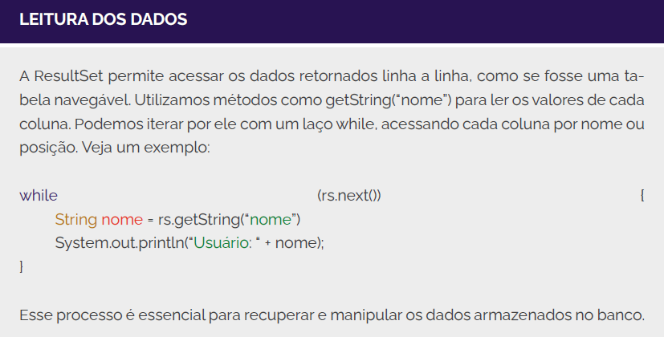
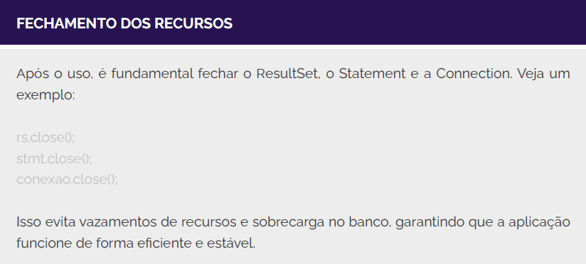
Essas etapas — carregar o driver, montar a URL, estabelecer a conexão, executar o comando e tratar o resultado — formam a base da integração entre Java e o banco de dados (Oracle, 2020). Embora simples em conceito, é a partir delas que surgem soluções complexas e profissionais.

## Tratamento de Exceções e Boas Práticas com Recursos
Quando uma aplicação Java se comunica com um banco de dados por meio do JDBC, diversas coisas podem dar errado. Conexões podem falhar, comandos SQL podem conter erros de sintaxe, e até mesmo o banco pode ficar indisponível. Por isso, é fundamental que você esteja preparado para lidar com exceções e utilize os recursos do Java de forma segura e eficiente.

O primeiro cuidado é sempre envolver as operações com banco de dados dentro de um bloco try-catch. O JDBC pode lançar exceções do tipo SQLException, que devem ser capturadas para que a aplicação não seja interrompida de forma inesperada (Oracle, 2020).

Porém, existe uma forma mais moderna e segura de fazer isso em Java: utilizando o try-with-resources. Esse recurso garante que os objetos que implementam a interface AutoCloseable, como Connection, Statement e ResultSet, sejam automaticamente fechados ao final do bloco try, mesmo que ocorra um erro no meio da execução. Isso reduz o risco de esquecer de fechar recursos, melhora a legibilidade e torna o código mais robusto (Oracle, 2020). 

Além disso, sempre que possível, evite construir comandos SQL com concatenação de strings. Isso pode abrir brechas para ataques de injeção de SQL. O ideal é usar PreparedStatement, que veremos mais adiante.

Outra boa prática é isolar a lógica de acesso ao banco de dados em classes específicas. Isso facilita a manutenção e permite que seu código siga os princípios de organização, como a separação de responsabilidades.

# Criando o Projeto Java com Maven e Configurando o JDBC
Para criar o projeto, siga estes passos: 1) Abra o IntelliJ IDEA Community; 2) Na tela inicial, clique em New Project; 3) No menu lateral esquerdo, selecione Java; 4) Em Build system, escolha a opção Maven; 5) No campo JDK, selecione uma versão instalada (recomenda-se JDK 17 ou superior); 6) No campo Name, digite o nome do seu projeto, como cadastro-usuarios; 7) Escolha uma pasta para salvar o projeto; e, por fim, 8) Clique em Create.

Após alguns segundos, o IntelliJ criará a estrutura básica do projeto com Maven. No lado esquerdo, você verá o arquivo pom.xml (ver Figura abaixo), responsável por controlar as bibliotecas externas utilizadas na aplicação.
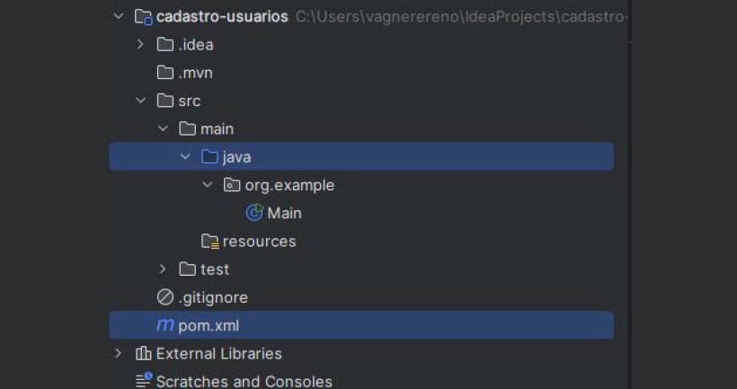
O próximo passo é adicionar ao seu projeto a biblioteca, as bibliotecas do maven podem ser encontrada no link https://mvnrepository.com/, que permite ao Java
se comunicar com o MySQL. Para isso, edite o arquivo pom.xml e adicione o
seguinte bloco dentro da tag <'dependencies'> (Oracle, 2020):
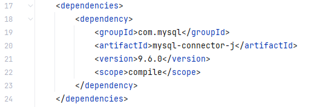
Após salvar o pom.xml, o IntelliJ deve automaticamente baixar o conector JDBC e adicioná-lo às External Libraries (lateral esquerda). Se não acontecer, clique com o botão direito no projeto e selecione Reload Maven Project.

## Construindo a aplicação Java com JDBC
Agora que temos o ambiente configurado, o banco de dados criado e o driver JDBC instalado no projeto, chegou o momento de começar a desenvolver a aplicação Java. Nessa etapa, vamos criar a estrutura inicial do projeto e implementar o código necessário para inserir dados na tabela usuarios.

Organizar bem seu projeto é essencial para facilitar a leitura, manutenção e evolução do código. Por isso, o primeiro passo é criar um pacote para agrupar as classes da aplicação. No IntelliJ, clique com o botão direito na pasta src/main/java, selecione New > Package, e crie um pacote com o nome: com.cadastro.usuarios. Dentro desse pacote, vamos criar três classes:

* Usuario.java: representa o modelo de dados.
* Conexao.java: gerencia a conexão com o banco.
* Aplicacao.java: classe principal da aplicação.

Vamos começar criando a classe Usuario, que representa os dados de um usuário no sistema. Essa classe será usada para encapsular as informações que serão armazenadas e recuperadas do banco de dados (Oracle, 2020):
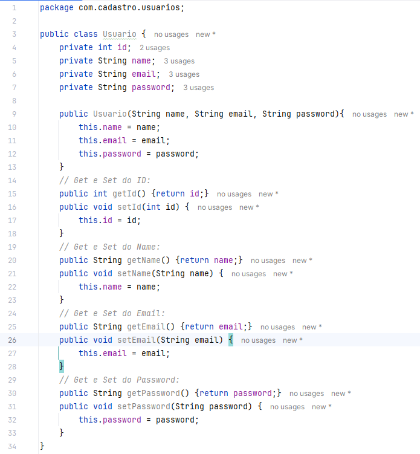
Note que o campo id não está presente no construtor, pois ele será gerado automaticamente pelo banco de dados. Por outro lado, é importante que todos os atributos tenham métodos getters e setters para que possamos usá-lo em operações futuras, como listagem e atualização (Oracle, 2020).

Agora, vamos popular a classe denominada Conexao, que será responsável por fornecer a conexão com o banco de dados MySQL. Isso ajuda a centralizar a lógica de conexão e evita duplicação de código (Oracle, 2020).
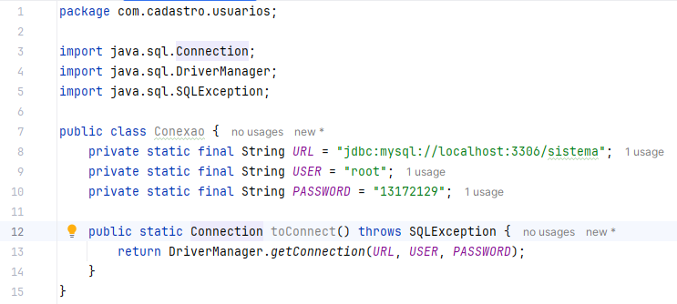
Substitua o valor de SENHA pela senha que você configurou no MySQL. Esta classe é simples e retorna uma conexão sempre que for chamada.

Por fim, vamos popular a classe principal da aplicação. Inicialmente, ela será responsável por executar a inserção de um usuário no banco de dados. Essa inserção será feita por meio de um método chamado inserirUsuario:
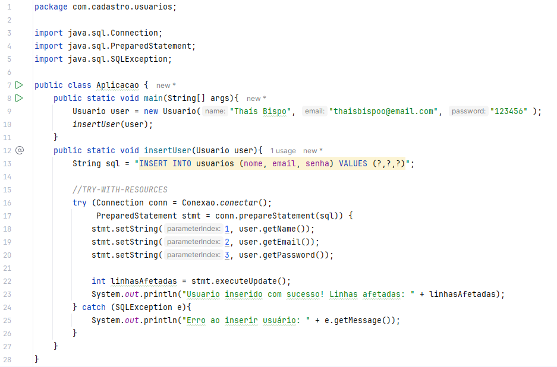

## Implementando as operações CRUD completas
Agora que nossa aplicação já consegue inserir usuários no banco de dados, vamos complementar o sistema com as demais operações fundamentais do modelo CRUD: leitura (Read), atualização (Update) e exclusão (Delete). 

Para manter o exemplo simples, continuaremos utilizando apenas a classe Aplicacao. Com isso, você poderá visualizar todas as operações reunidas em um único lugar e compreender o funcionamento prático de cada uma delas. 

Vamos começar exibindo todos os usuários cadastrados na tabela usuarios:
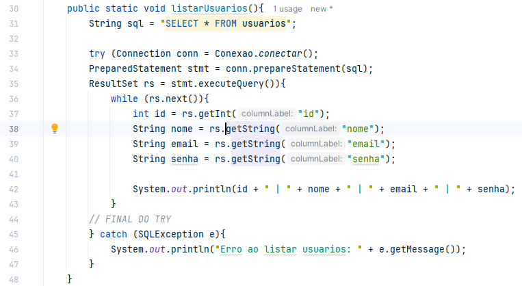
Em seguida, podemos modificar os dados de um usuário com base em seu ID:
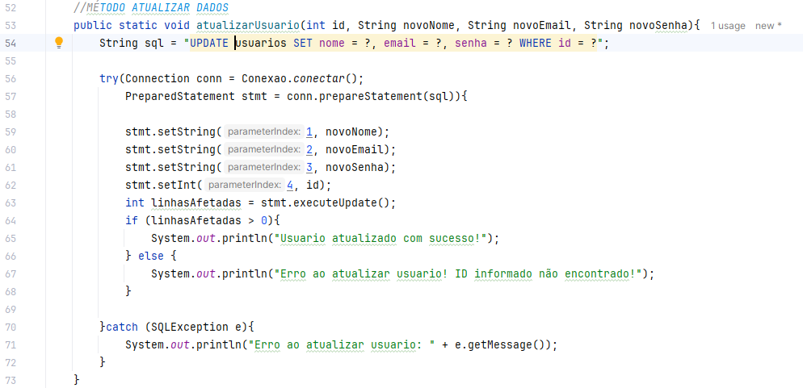
Por fim, a exclusão de usuários também pode ser feita de maneira simples:
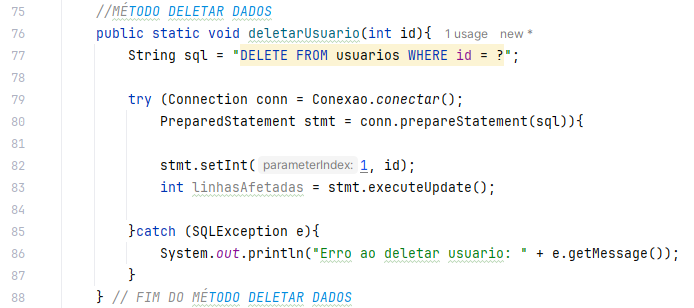