<h1>SERVLETS NO DESENVOLVIMENTO WEB JAVA</h1> 

Um Servlet é uma classe Java que roda dentro de um servidor de aplicações e atua como o cérebro por trás das interações web. Quando um navegador faz uma requisição HTTP (como acessar uma página ou enviar um formulário), o Servlet entra em ação para decidir o que fazer com essa informação: processar dados, consultar o banco, redirecionar o usuário ou gerar uma resposta personalizada (Juneau, 2020).

Para facilitar, pense nos Servlets como os "porteiros" de uma aplicação web: eles recebem os pedidos de quem chega (o navegador), analisam o que está sendo pedido e respondem adequadamente, seja com uma página, uma mensagem ou uma ação no sistema.

Esses componentes fazem parte da especificação Java EE (atualmente Jakarta EE) e são essenciais para criar aplicações web que vão além do HTML estático. Com eles, conseguimos adicionar lógica de programação entre o que o usuário vê na tela e o que está por trás do sistema.

Ao longo deste conteúdo, veremos como esses Servlets funcionam na prática, como são estruturados e de que maneira se conectam com outras tecnologias web, como o JSP. Mas por enquanto, guarde a ideia central: Servlets são o ponto de entrada para processar requisições e gerar respostas dinâmicas em uma aplicação Java web.

## Ciclo de Vida de um Servlet
Esse ciclo começa quando o servidor carrega a aplicação pela primeira vez ou quando um Servlet é requisitado pela primeira vez. A partir daí, a instância do Servlet é criada e mantida em memória, pronta para processar requisições sempre que necessário. Para ilustrar esse processo, observe a figura a seguir:
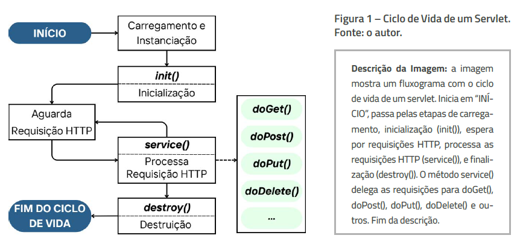

O ciclo de vida de um Servlet é composto pelas seguintes etapas:
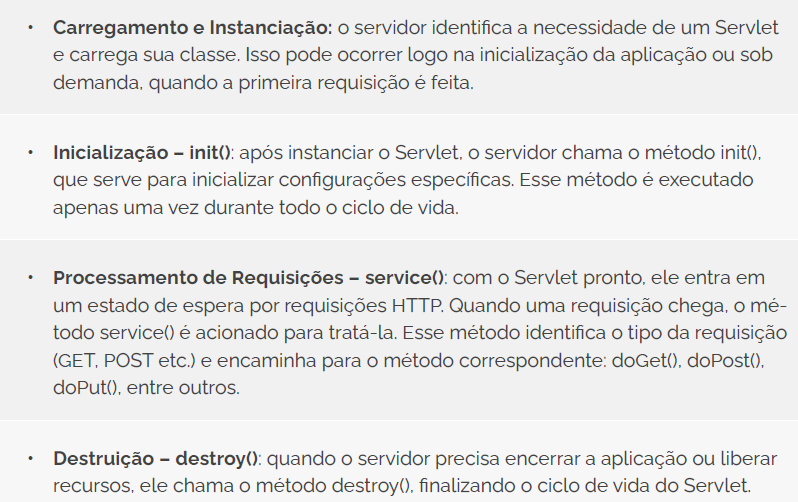


# ENTENDENDO O PROCESSAMENTO DE REQUISIÇÕES
Você já sabe que aplicações web funcionam com base na troca de informações entre navegador e servidor. Essa troca acontece por meio do protocolo HTTP — uma espécie de linguagem combinada que define como as mensagens são enviadas e recebidas na web (Caelum, 2021).

Entre os diversos métodos definidos por esse protocolo, os mais comuns e importantes para aplicações Java com Servlets são o GET e o POST. Ambos servem para solicitar uma resposta do servidor, mas têm propósitos e comportamentos diferentes.

O método GET é geralmente usado para recuperar informações. Quando você acessa uma página, faz uma busca ou clica em um link, o navegador geralmente envia uma requisição GET. Os dados são transmitidos pela URL, o que torna esse método mais simples e rápido, porém menos seguro para o envio de dados sensíveis.

Já o método POST é utilizado quando se deseja enviar informações ao servidor, como ao preencher e submeter um formulário. Nesse caso, os dados são incluídos no corpo da requisição, o que permite o envio de grandes volumes e garante mais segurança, já que não ficam visíveis na barra de endereços.

No universo dos Servlets, o Java oferece duas formas principais de lidar com esses métodos: os métodos doGet() e doPost() (Caelum, 2021). Sempre que o servidor recebe uma requisição, ele verifica qual foi o método HTTP usado e chama a função correspondente dentro do Servlet.

## Mapeamento de URLs e parâmetros em Servlets
Imagine que um usuário acessa o endereço www.sistema.com/usuarios. Como o servidor sabe qual parte do seu código Java deve responder a essa requisição? A resposta está no mapeamento de URLs (Juneau, 2020).

Em uma aplicação Java Web com Servlets, você pode indicar, por meio de anotações ou arquivos de configuração, quais URLs devem ser associadas a quais Servlets. Isso significa que, ao digitar um determinado endereço, o servidor saberá qual classe deve ser executada para gerar a resposta.

A forma mais comum de fazer isso atualmente é com a anotação @WebServlet (Juneau, 2020). Veja um exemplo simplificado:

```
@WebServlet("/usuarios")
public class UsuarioServlet extends HttpServlet {
    // código do Servlet aqui
}
```
Nesse caso, sempre que o navegador acessar /usuarios, o servidor executará o código presente em UsuarioServlet.

Mas, além de identificar qual classe deve responder, o Servlet também precisa lidar com os parâmetros enviados na requisição, especialmente em métodos GET e POST. Esses parâmetros podem ser dados digitados pelo usuário em formulários ou valores passados pela URL (Juneau, 2020).

Por exemplo, se o navegador acessar: ``/usuarios?nome=Ana&idade=25``, o Servlet pode capturar esses dados com: 

```
String nome = request.getParameter("nome");
String idade = request.getParameter("idade");
```

Esses métodos permitem extrair valores individuais de campos preenchidos no navegador, facilitando a construção de páginas dinâmicas baseadas no que o usuário deseja.

É importante mencionar que, para que um Servlet entre em ação, ele precisa estar corretamente mapeado a uma URL. Esse mapeamento é o que permite ao servidor saber qual classe Java deve responder a determinada rota acessada pelo navegador.

# INTRODUÇÃO AO JAVASERVER PAGES (JSP)
Quando você acessa um site moderno, é natural esperar que a página mude de acordo com o seu comportamento. Seja exibindo seu nome, resultados de uma busca ou notificações personalizadas, tudo isso exige conteúdo dinâmico.

Na programação Java para web, uma das primeiras tecnologias desenvolvidas para esse propósito foi o JavaServer Pages (JSP) (Juneau, 2020). Com ela, tornou-se possível criar páginas que não apenas exibem conteúdo estático em HTML, mas que também podem incluir código Java embutido, responsável por gerar dinamicamente o que o usuário vê na tela.

O JSP foi projetado para trabalhar em conjunto com os Servlets: enquanto os Servlets cuidam da lógica de controle, o JSP fica responsável pela apresentação da informação, ou seja, o que o usuário vê no navegador.

## Sintaxe básica do JSP e expressões
Uma página JSP é, essencialmente, um arquivo com extensão .jsp que contém HTML como qualquer outra página da web, mas com a vantagem de poder incluir instruções em Java que serão processadas no servidor antes de enviar o resultado ao navegador (Murach; Urban, 2014).

Existem quatro formas principais de incorporar Java em uma página JSP:
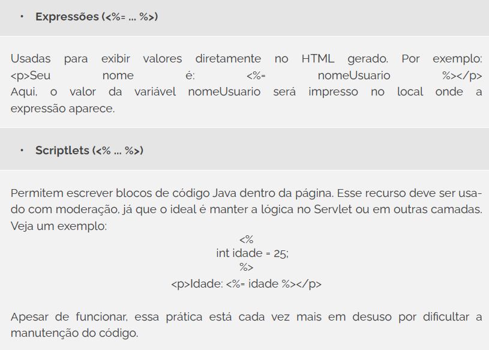
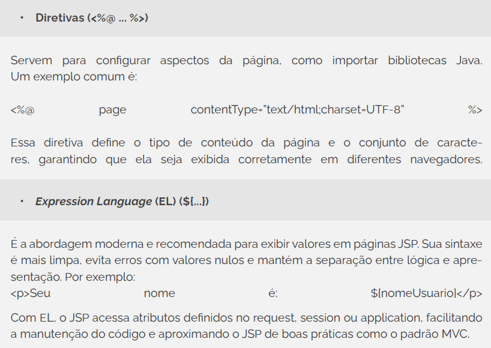
Esses elementos formam a base da programação com JSP. Embora seja possível escrever lógica diretamente na página, uma boa prática é utilizar o JSP apenas para exibir informações, deixando o processamento de dados para os Servlets. Isso mantém o código mais limpo, organizado e fácil de evoluir. 

## Exemplo de Geração de Página Dinâmica
Depois de entender a sintaxe básica do JSP, que tal ver um exemplo prático funcionando? Vamos criar uma página que receba um nome vindo de um formulário HTML e exiba uma saudação personalizada usando JSP (Murach; Urban, 2014). O objetivo aqui é mostrar, de forma simples, como o conteúdo dinâmico é gerado com base em dados enviados pelo usuário.

Imagine que temos o seguinte formulário HTML (ele pode estar em uma página estática ou em um JSP separado):
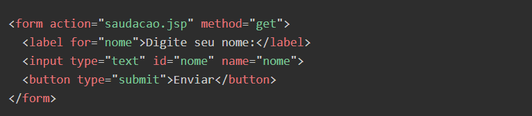

Esse formulário envie os dados para a páginasaudacao.jsp, que será responsável por receber o parâmetro nome e exibir uma resposta dinâmica:
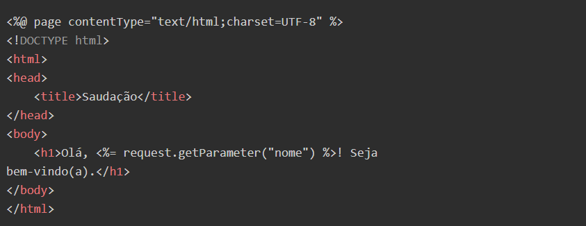

Observe o funcionamento: ao preencher o campo e clicar em “Enviar”, o navegador envia o valor digitado como parâmetro da URL. O JSP recupera esse valor com request.getParameter("nome") e o insere diretamente no HTML que será exibido para o usuário.

Esse é um dos usos mais básicos (e poderosos) do JSP: tornar o conteúdo das páginas sensível aos dados que chegam de formulários, URLs ou outras fontes (Murach e Urban, 2014). A partir daqui, podemos construir experiências mais interessantes, como exibir resultados de busca, mostrar mensagens personalizadas ou apresentar dados recuperados de um banco.

# INTEGRAÇÃO ENTRE SERVLETS E JSP

À medida que as aplicações web crescem em complexidade, separar bem as responsabilidades de cada parte do sistema torna-se essencial. Quando usamos apenas Servlets, toda a lógica de negócio e a apresentação acabam ficando misturadas em uma única classe Java, o que dificulta a manutenção e a reutilização. Por outro lado, o JSP sozinho não é ideal para executar regras de negócio ou acessar o banco de dados (Juneau, 2020).

Por isso, a boa prática é dividir os papéis da seguinte forma:

* O Servlet atua como controlador: ele recebe as requisições, processa os dados, acessa o banco quando necessário e decide qual página será exibida.

* O JSP é responsável apenas por exibir os dados: ele apresenta a resposta ao usuário de forma visual, usando HTML combinado com pequenos trechos de código Java, se necessário.

Essa separação segue o padrão arquitetural MVC (Model-View-Controller), muito utilizado em aplicações web. Embora o padrão MVC seja abordado em mais profundidade mais adiante, aqui já começamos a aplicá-lo de maneira prática. Veja um exemplo simplificado na Figura 2, que ilustra esse fluxo:
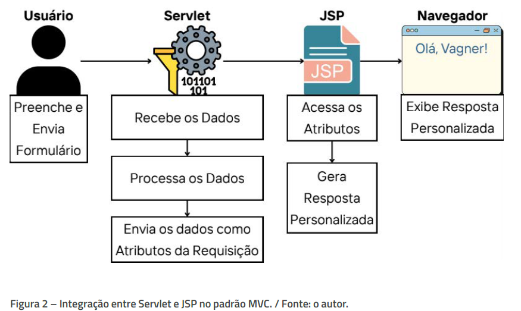
No exemplo da imagem, o usuário envia um formulário com seu nome. O Servlet atua como controlador: ele recebe os dados do formulário, processa a lógica necessária e envia os dados como atributos da requisição. Logo após, o controle é encaminhado internamente para o JSP, que acessa esses atributos e gera uma resposta personalizada, como uma saudação ou confirmação, que será exibida ao usuário no navegador (Juneau, 2020).

Esse tipo de organização facilita muito a manutenção do código e permite que designers trabalhem na interface (JSP) enquanto desenvolvedores cuidam da lógica (Servlets).

## Encaminhamento de dados com RequestDispatcher
A figura anterior ilustrou bem o papel dos Servlets e JSPs em uma aplicação web baseada no padrão MVC. O Servlet recebe a requisição, processa os dados e transfere as informações para a camada de visualização (o JSP), que monta a resposta exibida ao usuário (Caelum, 2021).
É aqui que entra o RequestDispatcher. Ele é o componente responsável por encaminhar o fluxo de execução, ainda dentro do servidor, para outro recurso, como uma página JSP. E o mais importante: ele permite que o Servlet anexe dados à requisição, que poderão ser acessados pelo JSP.

Na prática, o uso segue dois passos principais (Juneau, 2020):

1. Armazenar dados na requisição: o Servlet insere os dados com o método setAttribute, por exemplo:   request.setAttribute("nomeUsuario", "João");

2. Encaminhar a requisição para o JSP: com os dados já disponíveis na requisição, o Servlet repassa o controle:  RequestDispatcher rd =   request.getRequestDispatcher("boasvindas.jsp");  rd.forward(request, response);

Do lado do JSP, podemos recuperar o dado com:

Esse encaminhamento ocorre sem redirecionamento de URL, ou seja, o navegador continua acreditando que está na mesma rota inicial. Isso torna a resposta mais rápida e evita a exposição de rotas internas (Juneau, 2020).

Além de separar responsabilidades, esse fluxo facilita a manutenção da aplicação e prepara o terreno para adoção de frameworks mais robustos no futuro, como o JavaServer Faces (JSF), que automatiza parte desse processo.

# MINIAPLICAÇÃO INTEGRADA: SERVLET & JSP
Vamos construir uma aplicação simples que recebe o nome do usuário por meio de um formulário HTML, processa essa informação com um Servlet e apresenta uma saudação personalizada em uma página JSP (Caelum, 2021). Essa é a base de inúmeras aplicações web reais: entrada de dados, processamento e resposta.
## Configuração do Ambiente
Para o exemplo desta miniaplicação integrada com Servlet e JSP, utilizaremos o IntelliJ IDEA Ultimate, pois essa versão da IDE oferece suporte nativo a desenvolvimento web, incluindo integração direta com servidores de aplicação como o Apache Tomcat. Isso torna o processo de execução mais simples e direto, especialmente para visualizar a aplicação rodando no navegador sem a necessidade de configurações manuais complexas.

* Caso você ainda não saiba como configurar o Tomcat no IntelliJ IDEA, assista a este vídeo, que demonstra de forma clara e prática como configurar e utilizar o Tomcat na IDE, o que será essencial para rodar a aplicação com sucesso.
<a href="https://www.youtube.com/watch?v=L5xJU9vXRL0">vídeo explicativo</a>

Uma vez que você já possui o Apache Tomcat instalado e configurado no IntelliJ IDEA Ultimate, podemos iniciar o processo de criação do projeto web com suporte a Servlets e JSP. Vamos seguir os seguintes passos:

1) <strong></strong>Criar um novo projeto no IntelliJ: na tela inicial da IDE, clique em File > New > Project. No menu lateral, selecione a opção Jakarta EE, pois ela já inclui os templates necessários para aplicações web Java.

2) <strong>Definir as configurações do projeto:</strong>      
a. <i>Nome do projeto:</i> escolha um nome como cadastro.    
b. <i>Build System:</i> selecione Maven.    
c. <i>Template:</i> selecione Web application (isso incluirá o web.xml, index.jsp e configuração básica).    
d. <i>Application Server:</i> selecione o Apache Tomcat (versão 9 ou superior). Se ainda não tiver adicionado à IDE, clique em New... e localize a pasta onde o Tomcat foi instalado.    
e. <i>JDK:</i> selecione uma versão compatível, como o Java 22 (ou uma versão LTS estável).    
f. <i>Group e Artifact:</i> defina algo como org.example e cadastro, respectivamente.

3) <strong>Escolher as dependências:</strong> na próxima tela, marque a dependência Servlet dentro das implementações. Essa dependência permitirá que sua aplicação utilize classes como HttpServlet, HttpServletRequest e HttpServletResponse.

4) <strong>Finalizar criação do projeto:</strong> clique em Create. O IntelliJ criará a estrutura do projeto, incluindo as pastas src/main/java para suas classes Java e src/main/webapp para suas páginas JSP e arquivos estáticos.

### EU INDICO
Se você tiver dúvidas ou quiser aprofundar o entendimento sobre como criar e executar aplicações web com Jakarta EE no IntelliJ IDEA, recomendo o tutorial da JetBrains. Ele apresenta, passo a passo e com imagens, como configurar seu ambiente e iniciar sua primeira aplicação web com Servlets e JSP. Clique aqui e acesse o <a href="https://www.jetbrains.com/help/idea/creating-and-running-your-first-jakarta-ee-application.html">link</a>.

## Criando a Primeira Página JSP
Vamos começar a construir a aplicação desenvolvendo a interface inicial que o usuário verá ao acessar o sistema. Essa página será escrita em JSP (JavaServer Pages), mas ainda conterá apenas elementos estáticos, como um título e um formulário simples para entrada de dados (Murach; Urban, 2014).

Para isso, abra o arquivo chamado `index.jsp` dentro da pasta `src/main/webapp`. Esse arquivo será a porta de entrada da aplicação, ou seja, será exibido no navegador quando o projeto for iniciado. O código a seguir apresenta um exemplo básico de conteúdo para essa página:
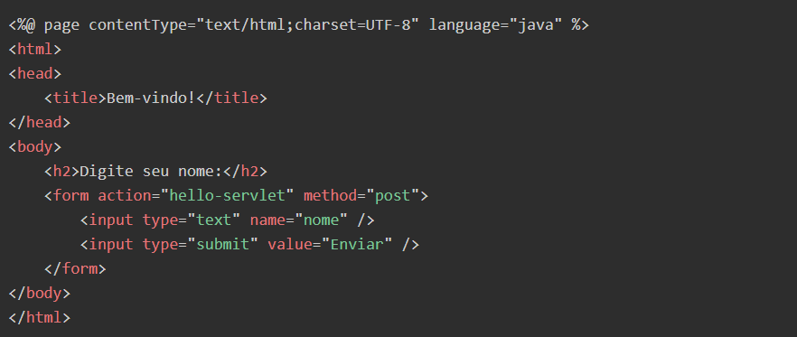
Nesse exemplo, usamos uma estrutura básica de HTML combinada com a diretiva JSP <%@ page ... %>. O formulário é configurado para enviar os dados ao Servlet mapeado como "hello-servlet", utilizando o método POST.

## Criando o Servlet para Processar a Requisição
Agora que temos a interface preparada com a página JSP, o próximo passo é programar o componente que fará o processamento da entrada enviada pelo usuário. Esse papel é desempenhado pelo Servlet, uma classe Java que roda no servidor e lida diretamente com as requisições HTTP (Murach; Urban, 2014).

No IntelliJ, dentro da pasta src/main/java, localize o pacote “org.example.cadastro”. Ao criar o projeto Jakarta EE no IntelliJ IDEA, uma classe chamada <strong>HelloServlet</strong> foi gerada automaticamente. Vamos utilizá-la como base para implementar nossa lógica de processamento, aproveitando sua estrutura já integrada ao ciclo de vida da aplicação web.
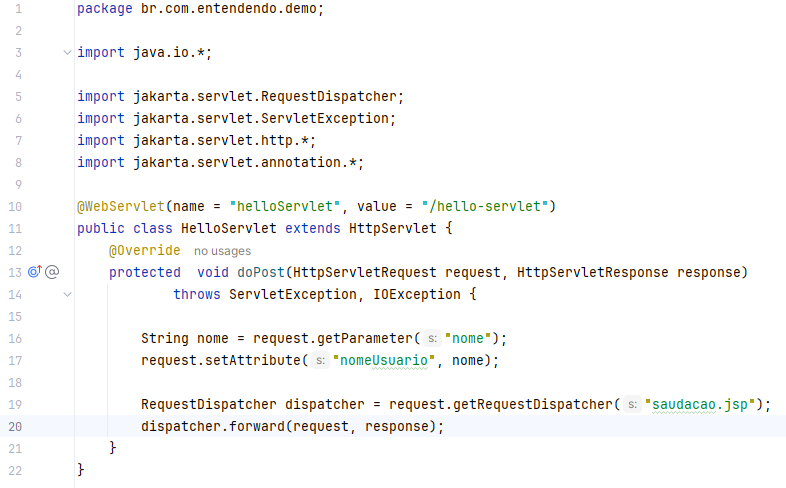
Nesse código, definimos que o Servlet responderá a requisições enviadas para a URL /hello-servlet, conforme especificado pela anotação @WebServlet. 

O método ``doPost`` é sobrescrito para interceptar os dados do formulário (neste caso, o nome do usuário), por meio do método getParameter. Esse valor é então armazenado como um atributo da requisição com o nome nomeUsuario. 

Em seguida, a requisição é encaminhada internamente para a página saudacao.jsp utilizando um RequestDispatcher, que permite transferir o controle da execução sem encerrar a resposta.

Esse fluxo é essencial para separar a lógica de controle (Servlet) da apresentação (JSP), promovendo uma arquitetura mais clara e manutenível.

## Exibindo a Saudação Personalizada
Depois que o Servlet processa os dados recebidos do formulário, ele repassa essas informações para uma nova página JSP (Murach; Urban, 2014). Essa página será responsável por apresentar a resposta personalizada, neste caso, uma saudação com o nome informado pelo usuário.

Vamos criar um novo arquivo chamado ``saudacao.jsp`` dentro da pasta webapp. Essa página acessará o atributo da requisição definido pelo Servlet e o exibirá diretamente na interface.
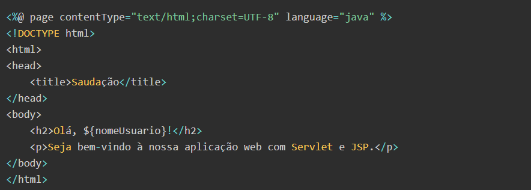
O destaque aqui está no uso da Expression Language (EL), a abordagem moderna que vimos anteriormente. A expressão ${nomeUsuario} acessa diretamente o atributo enviado pelo Servlet, mantendo a página JSP limpa e focada apenas na exibição dos dados. Esse valor é renderizado dinamicamente, criando uma resposta personalizada para cada usuário.

Com isso, a aplicação agora está completa: o usuário preenche o formulário em index.jsp, os dados são processados por HelloServlet.java e o resultado é exibido em saudacao.jsp.

## Visualizando o Resultado no Navegador
Para que tudo funcione corretamente, é essencial garantir que a versão do servidor Tomcat seja compatível com a versão da especificação Jakarta Servlet utilizada no projeto. No exemplo apresentado, utilizamos o Tomcat 10.1 em conjunto com a Jakarta Servlet 6. No entanto, essas versões podem evoluir ao longo do tempo. Por isso, recomenda-se sempre verificar a compatibilidade entre o servidor de aplicações e a versão das bibliotecas utilizadas no pom.xml, conforme a documentação oficial mais recente (Caelum, 2021).

Com o ambiente devidamente configurado, execute a aplicação clicando no botão de execução (run) no IntelliJ IDEA. Certifique-se de que a configuração esteja vinculada ao servidor Tomcat e ao artefato cadastro:war exploded. Em seguida, abra o navegador e acesse o endereço “http://localhost:8080/cadastro_war_exploded/”. A primeira tela apresentada será a página com o formulário, conforme ilustrado na Figura 4.
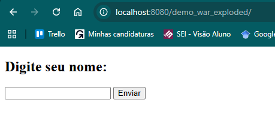
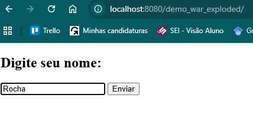
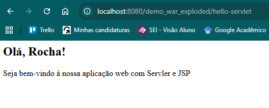

# SESSÕES E COOKIES EM APLICAÇÕES JAVA WEB
O protocolo HTTP é "sem estado" (stateless). Isso significa que, a cada nova requisição, o servidor não tem memória de interações anteriores com um mesmo cliente. Para contornar essa limitação e preservar o contexto entre as interações — como manter um usuário logado ou lembrar produtos em um carrinho de compras —, as aplicações Java Web utilizam sessões e cookies.

Esses dois mecanismos mantêm dados associados ao usuário, mas operam de maneiras distintas (Caelum, 2021):
* Sessões (server-side): são gerenciadas no lado do servidor. Ao criar uma sessão, o servidor armazena os dados e os associa a um identificador único (ID da sessão). Esse ID é enviado ao cliente (geralmente através de um cookie) e usado para recuperar o contexto a cada nova requisição. Por manter os dados no servidor, as sessões são mais seguras e ideais para informações sensíveis, como dados de login.
* Cookies (client-side): são pequenos arquivos de texto armazenados no navegador do cliente. O servidor envia o cookie e o navegador o anexa automaticamente às requisições futuras para o mesmo domínio. São úteis para dados não sensíveis que precisam persistir por longos períodos, como preferências de idioma ou temas.

# Trabalhando com Sessões em Aplicações Java Web
Em aplicações Java Web, a criação e o gerenciamento de sessões são realizados por meio da interface HttpSession, que faz parte da especificação Jakarta Servlet. Toda vez que um cliente realiza uma requisição ao servidor, podemos obter (ou criar) uma sessão associada a ele utilizando o método <Strong>``request.getSession()``</Strong> (Caelum, 2021).

Se já existir uma sessão válida para aquele usuário, o método <strong>``getSession()``</strong> a retorna. Caso contrário, uma nova sessão é criada automaticamente. Essa sessão permanece ativa enquanto o usuário interagir com a aplicação ou até que o tempo máximo de inatividade seja atingido.

Veja um exemplo básico de como criar uma sessão e armazenar um atributo:
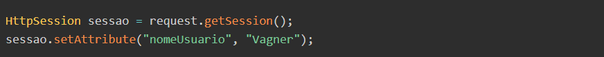
Neste trecho, é criada (ou recuperada) uma sessão associada ao usuário, e nela é armazenado um atributo chamado "nomeUsuario", com o valor "Vagner". Esse dado poderá ser acessado em qualquer ponto da aplicação enquanto a sessão estiver ativa (Caelum, 2021).

Mais adiante, para recuperar esse valor em outra parte da aplicação (por exemplo, em uma página JSP), usamos a Expression Language (EL) para acessar diretamente o escopo da sessão:

Note que usamos sessionScope, que é um objeto padrão do EL para acessar a sessão, e não o nome da variável sessao que usamos no Servlet.

Além de armazenar dados com setAttribute, o desenvolvedor pode controlar o tempo de vida da sessão (Caelum, 2021). Isso é feito por meio do método setMaxInactiveInterval, que define o tempo (em segundos) de inatividade permitido antes que a sessão expire automaticamente:
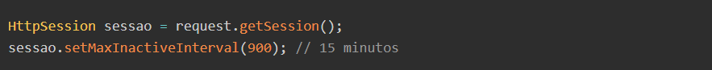
Esse controle é essencial para a segurança da aplicação, especialmente em ambientes onde há dados sensíveis ou múltiplos usuários ativos. Caso seja necessário encerrar a sessão manualmente (por exemplo, ao implementar uma funcionalidade de logout), basta utilizar: “sessao.invalidate();”.Com isso, todos os atributos da sessão são removidos e o usuário deixa de estar associado àquela instância de navegação (Caelum, 2021). O uso adequado de sessões é fundamental para manter o estado da aplicação e garantir uma experiência contínua para o usuário.

## Trabalhando com Cookies em Aplicações Java Web
Para implementar cookies em aplicações Java Web, utilizamos a classe Cookie, disponível na especificação Jakarta Servlet (Caelum, 2021). Ela permite criar, configurar e adicionar cookies à resposta enviada ao navegador do usuário. Veja um exemplo básico:

Esse trecho cria um cookie chamado "idioma", com valor "pt-BR", e o configura para expirar em sete dias. Ele é então enviado ao navegador, que armazenará localmente o dado.

Nas próximas requisições, esse cookie será automaticamente enviado ao servidor. Para recuperá-lo, usamos o método request.getCookies():
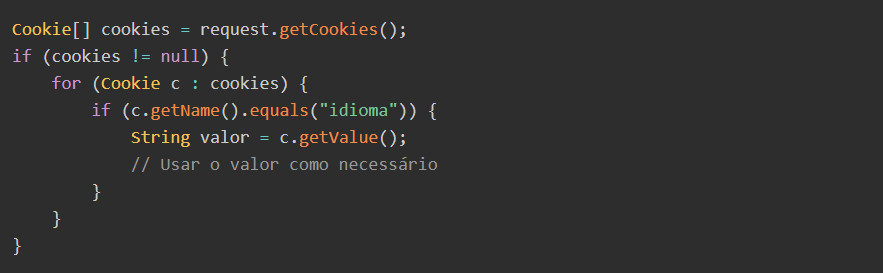

Esse código percorre os cookies recebidos e recupera o valor associado à chave "idioma". Essa abordagem permite personalizar a interface, lembrar preferências do usuário ou controlar comportamentos persistentes.

O uso estratégico de sessões e cookies permite construir aplicações Java Web mais robustas, adaptadas ao comportamento e às necessidades dos usuários.
<a href="https://vimeo.com/1109324314/7b19a12d42?fl=pl&fe=cm">Vídeo explicativo</a>